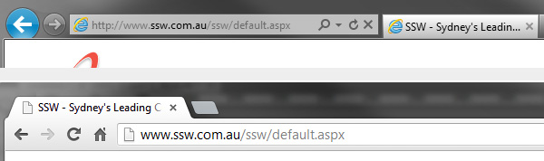
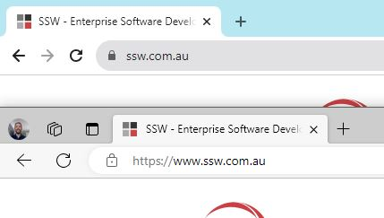

A Favicon is a small image file included on professionally developed sites. The favicon reflects the look and feel of the website or the organizations' visual identity.

<!--endintro-->

::: bad  
  
:::

::: good  
  
:::

### Which formats and sizes to use?

The format of the image must be one of PNG (a W3C standard), GIF, or ICO. You can export your favicon in all necessary sizes on [Favicon Generator website](https://realfavicongenerator.net/).

### How to implement the favicon?

1. Copy your company's favicon to the root of the site
2. Add the highlighted code below inside the &lt;HEAD&gt; tags in your HTML

::: greybox
&lt;head&gt;
			 &lt;title&gt;Page Title&lt;/title&gt;
<mark>&lt;link rel="shortcut icon" href="/images/favicon.ico" type="image/x-icon" /&gt;</mark>
			 &lt;/head&gt;  
:::
**Figure: One line of HTML lets you add your company's icon to your web page** 
**
**  
This works for most websites, including ASPX WebForms, MVC and WordPress.

We have        [SSW CodeAuditor](https://www.ssw.com.au/ssw/CodeAuditor/) and        [SSW LinkAuditor](https://www.ssw.com.au/ssw/LinkAuditor/) to check for this rule.
