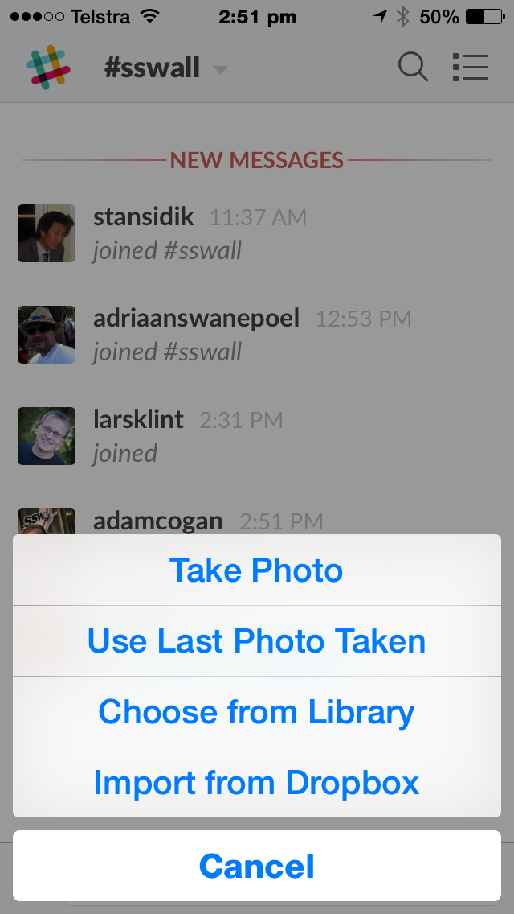

The best apps predict what the user is trying to do from context and does it for them.

<!--endintro-->
<dl>&lt;dt&gt;
 
&lt;/dt&gt;  ::: good Figure: Good Example – “Use Last Photo Taken” is a simple example from Slack. :::  </dl>
This is generally referred to as an “adaptive system.”

Smashing magazine has a much more detailed article regarding [adaptive systems](http://www.smashingmagazine.com/2012/12/10/creating-an-adaptive-system-to-enhance-ux/) from 2012 along with advanced examples.
