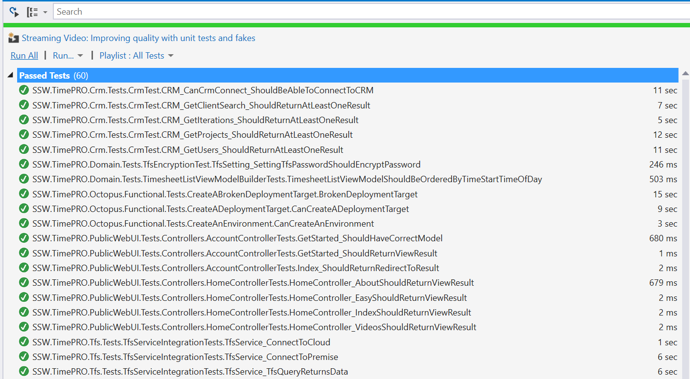
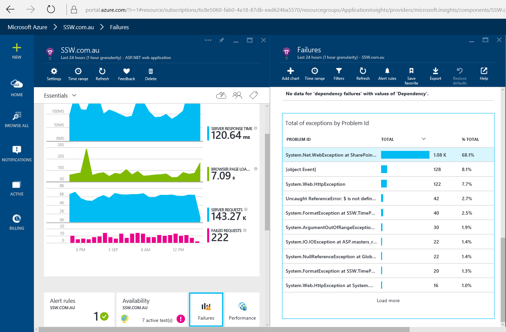
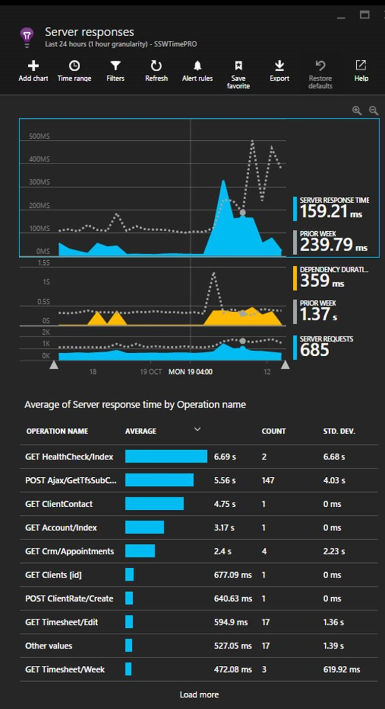

Before starting any work, you should ensure developers take a look at your Application Insights data to make sure everything is performing correctly.

<!--endintro-->

Most developers check only this first item before starting their work:

1. Check Unit Tests are Green

**Figure: Tests are green. I'm ready to start work... or am I?**

More advanced teams check their application insights data as well. This includes:

2. Look for any new Unhandled Exceptions

> See [Do you know the daily process to improve the health of your web application?](/do-you-know-the-process-to-improve-the-health-of-your-web-application)

> 
>
> **Figure: Unhandled Exceptions - Is there anything you don't know about here?**

3. Look for any obvious performance issues (Server then client).

> See [Do you know how to find performance problems with Application Insights?](/do-you-know-how-to-find-performance-problems-with-application-insights)

> 
>
> **Figure: Performance - The Server Responses tab shows the slowest running pages.**
