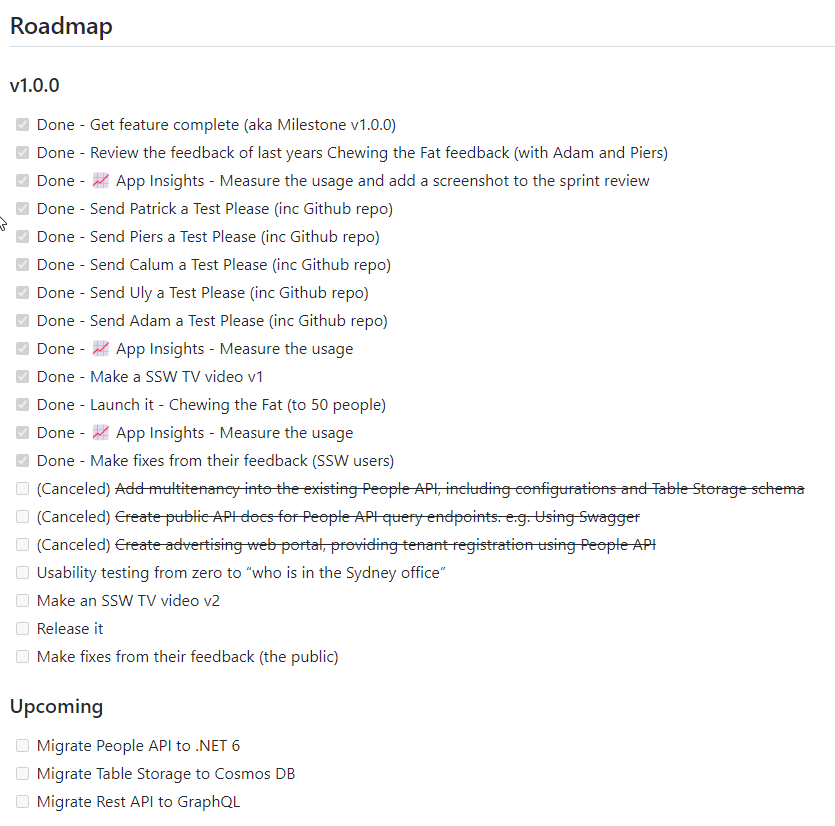

A product backlog is a great way to see the fairly small broken up PBIs (Product Backlog Items) that make up your team's to do list but it can be a bit too zoomed in making it easy to stray from the product goals.

<!--endintro-->

To get a better zoomed out look, you should have a product roadmap. 

Having this zoomed out look helps the team to stay focused on the overall goal of the project and the long term priorities. It also prevents the team from getting too side tracked on issues that are not really what the business wants.

### Methods

There are many ways to track a roadmap such as Azure DevOps Features or Epics, sometimes also known as MMFs (Minimum Marketable Features), but the concept is the same...

Our favourite way is to store it all in the project wiki. 

You should also add it as part of your regular Sprint Reviews to ensure that progress is regularly reviewed.

::: good

:::