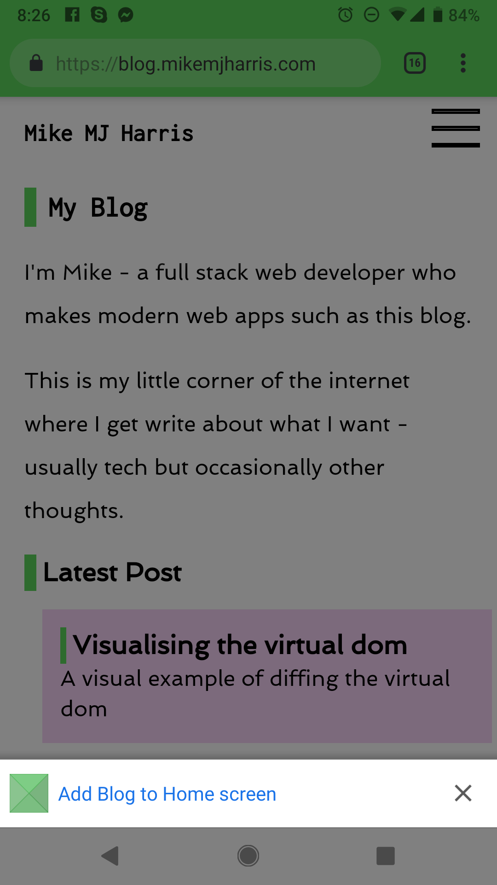

Progressive Web Apps have transformed the mobile web practices to provide a native app like experiences for the users. They work just like native apps and include features such as smoother navigations, offline modes and push notifications, but are much more economical and do not use the device storage.

Progressive Web Apps are reliable which means they load instantly and the performance isn't compromised even if the network is shaky.

On the mobile the 'Add to homescreen' option can be used to create an icon on you phone.

PWAs also account for higher user engagements and conversions which is probably why many organizations are now adapting this technology to grow their businesses.

<!--endintro-->

In order to be a PWA, your app should:

* **Use a responsive design** , so it works on desktop or mobile.
* **Be fast** , using a service worker to precache the app resources (HTML, CSS, JavaScript, images) needed to run, and cache the data at runtime to improve performance.
* **Be installable** , using a web app manifest and the beforeinstallprompt event to notify the user that it is installable.

Examples of Progressive Web Apps can be seen at [**https://mofluid.com/blog/10-best-progressive-web-apps**](https://mofluid.com/blog/10-best-progressive-web-apps/).
<dl class="badImage">&lt;dt&gt;&lt;/dt&gt;<dd>Figure: Bad Example - aliexpress get a mark of 6/12 (see tooltip) and cannot be used as a PWA</dd></dl><dl class="image">&lt;dt&gt; 
      
       
   &lt;/dt&gt;<dd>Figure: Accessing a PWA on your mobile will prompt adding it on your Home screen. E.g. <a href="https://blog.mikemjharris.com/">https://blog.mikemjharris.com</a> </dd></dl>
You can check the Progressive Web App score of your application using Chrome's Developer tools.

**Note:** See how to generate a PWA report on           https://developers.google.com/web/tools/lighthouse/#devtools.

<dl class="goodImage">&lt;dt&gt; 
            &lt;/dt&gt;<dd>Figure: Good Example - Aim for a good Progressive Web App score</dd></dl>
