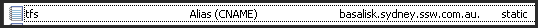

Always [plan for a catastrophic disaster](http://www.ssw.com.au/SSW/Standards/Rules/RulesToBetterNetworks.aspx#assumeCatastrophic), in the event of errors when testing:

1. Take the TFS2010 server offline
2. Bring the TFS2008 server online
3. Change the DNS entries for tfs.northwind.com from the IP for the TFS2010 server to the IP for the TFS2008 server
    1. Internal DNS Server
    2. External DNS Server

<!--endintro-->
