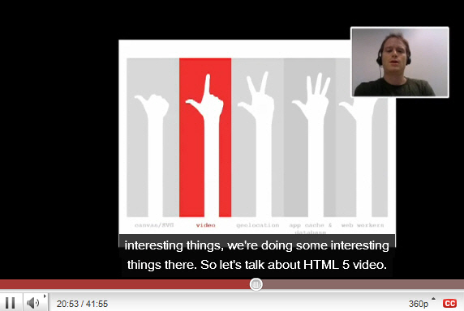

You should have a good cover slide for each section of your presentation. They are called "section break" slides and are meant to visually divide the content structure. These slides should be                     consistent so they do not confuse the audience.

<!--endintro-->
<dl>    &lt;dt&gt; &lt;/dt&gt;
    <dd class="ms-rteCustom-FigureGood">Figure: Good example – This is very clear that we are up to part 2 of the presentation </dd></dl>
