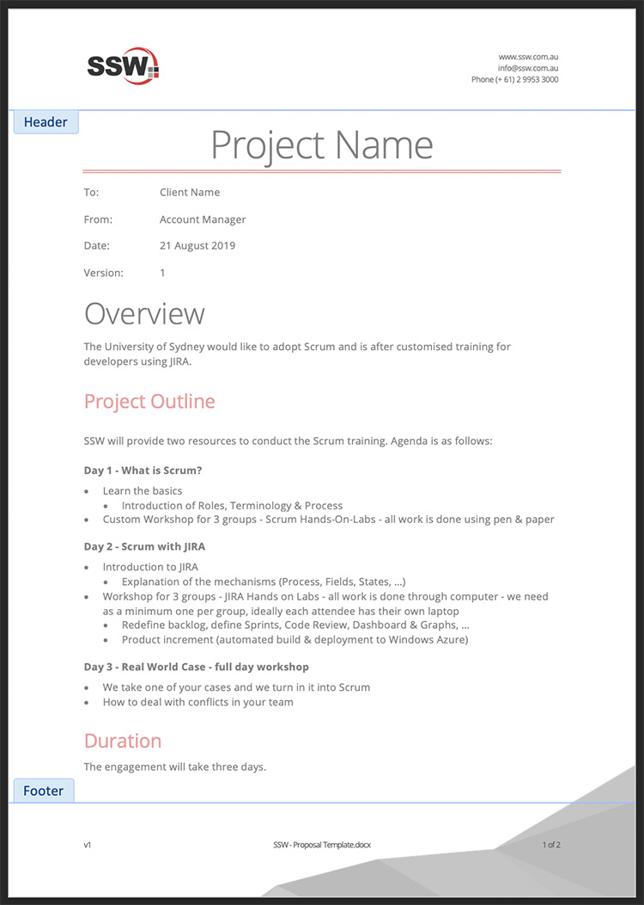

A strong header and footer will make the client sure that document is from your company in any page he is looking at.

<!--endintro-->
<dl class="goodImage">&lt;dt&gt; &lt;/dt&gt;<dd>Good Example - The header and footer are consistent, using the company colours and all the necessary information</dd></dl>
