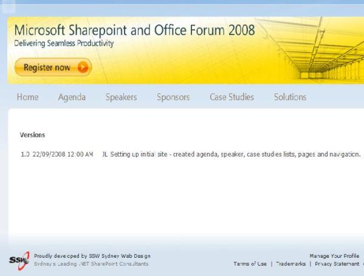

  
Each time you deploy a new package to your SharePoint site, you should add a new entry in the version list.

This will enable you to quickly find out which version of the package your SharePoint site is using, and let users know what version they are running.

 <excerpt class='endintro'></excerpt> 

  

    
  

 

<ul>
    <li>A custom list for Version should be created at the root level of a SharePoint site collection, and each time a package is deployed - a new record should be added to this version list. </li>
    <li>A simple blank page with a Content Query Web Part can display this versions list in a friendly manner. </li>
    <li>We do not change the version numbers in the .NET Assembly because the assemblies have to be strong-name signed and deployed to the GAC.  So having a versions list is crucial in working out what version of your package is deployed on which server.</li>
</ul>

