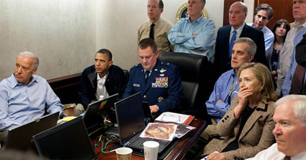
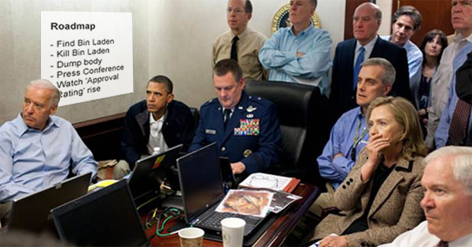

The Scrum team needs a place to gather for all the Scrum ceremonies. This room should have useful information on the wall to help the team work more efficiently. We recommend having the following:

::: info
**Note:** For co-located teams only.
:::

* [Task Board](/the-war-room-does-your-development-room-have-an-electronic-task-board-physical-is-ok-too-for-small-co-located-teams) (to show current work in progress)
* [The 8 Steps to Scrum PDF](https://ssw.com.au/downloads/8StepstoScrum.pdf) (to show how we work)
* [The 3 Steps to a PBI PDF](https://github.com/SSWConsulting/SSW.Rules.Content/raw/main/rules/do-you-have-a-war-room-summary/3StepsToAPBI.pdf) (to know the lifecycle of a PBI)
* [Product Roadmap](/do-you-have-a-product-roadmap) (to let everyone know the large future priorities)
* [Definition of Done - aka Done Criteria or DoD](/definition-of-done) (the quality that is being adhered to)

<!--endintro-->

::: bad

:::

::: good

:::
