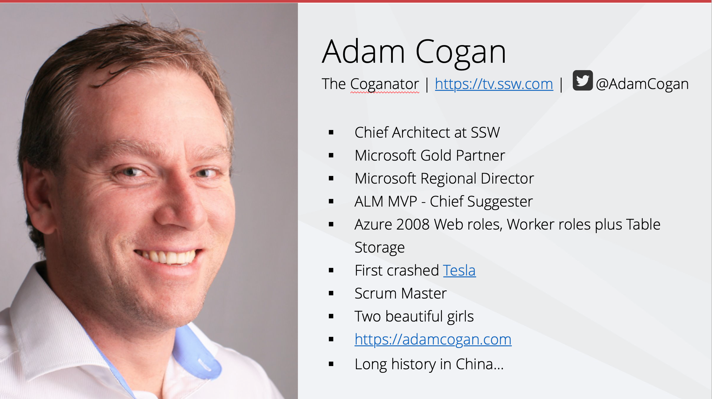

Always **introduce yourself** to the audience. However, it is not great to bring up the 'About' slide too early, so you should do it \*after\* you have asked the audience who they are. 

<!--endintro-->

Don't be shy, tell them:

* Who are you? 
  - Optional - include something personal
* What you do (your service or product)?
* What makes you qualified to speak on this topic?

::: good

:::
