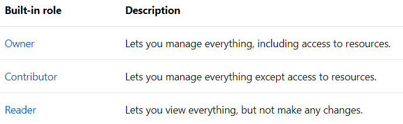
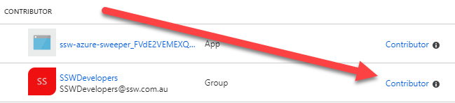
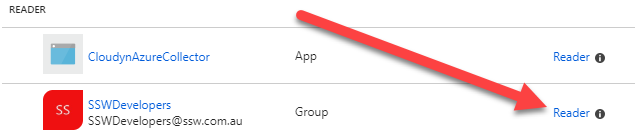

Azure is Microsoft's Cloud service. However, you have to pay for every little bit of service that you use. 

<!--endintro-->

Before diving in, it is good to have an understanding of the basic built-in user roles:

  

**More info:** https://docs.microsoft.com/en-us/azure/role-based-access-control/built-in-roles

It's **not** a good idea to give everyone 'Contributor' access to Azure resources in your company. The reason is cost: Contributors can add/modify the resources used, and therefore increase the cost of your Azure build at the end of the month. Although a single change might represent 'just a couple of dollars', in the end, everything summed up may increase the bill significantly.

The best practice is to have an **Azure Spend Master**. This person will control the level of access granted to users. Providing "Reader" access to users that do not need to/should not be making changes to Azure resources and then "Contributor" access to those users that will need to Add/Modify resources, bearing in mind the cost of every change.

Also, keep in mind that you should be giving access to security groups and not individual users. It is easier, simpler, and keeps things much better structured.

::: bad  
  
:::

::: good  
  
:::
