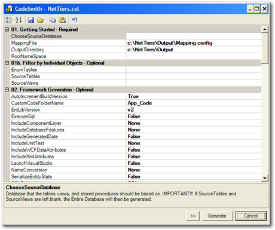
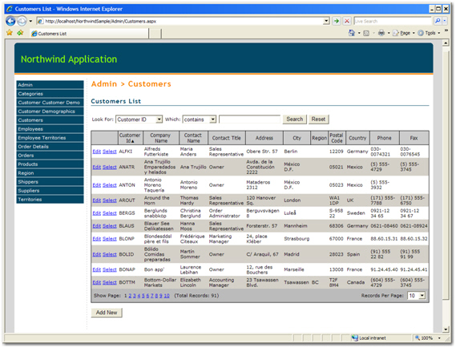

Nowadays, most application are dealing with Data. And it would be nice to have maintenance pages to manage data (select, insert, update and delete). 

We recommend you create the maintenance pages by netTiers. <a href="https://github.com/netTiers/netTiers/wiki/Getting-Started">netTiers</a> is a set of open source code templates used in CodeSmith for object-relational mapping. It automatically generates a personalized Data Tiers application (on a base of a SQL Server Database) in just a few minutes. With the application it generated, you can manage data of a web application easily and efficiently.

Please follow these steps to create your maintenance pages.   

 <excerpt class='endintro'></excerpt> 
<ol><li>
      <a href="http://www.codesmithtools.com/" target="_blank">Download</a> CodeSmith. </li><li>Download .netTiers and extract to a folder (e.g., C:\Program Files\Net​Tiers)</li><li>Install CodeSmith.</li><li>Run C:\Program Files\NetTiers\NetTiers.cst.</li><li>Set requires properties following instructions.</li><dl class="image"><dt>   </dt><dd>Figure: Properties Window</dd></dl><li>Generate.</li><li>Open the solution. </li><li>Build it and run it in IE.</li><li>Congratulations! It's up and running.</li><dl class="image"><dt>  </dt><dd>Figure: The application is running</dd></dl></ol>
Code ​Smith enables to do this generate with a single command. If you want to generate it again, just run this command.
<dl class="code"><dt><pre>cs D:\DataDavidBian\Personal\New12345\NetTiers.csp</pre></dt><dd>Figure: An example of command line of Code Smith for NorthWind</dd></dl>
We recommend you put this command in a file called "_Regenerate.bat" and add it in the solution in case you will generate it again in future.

 

