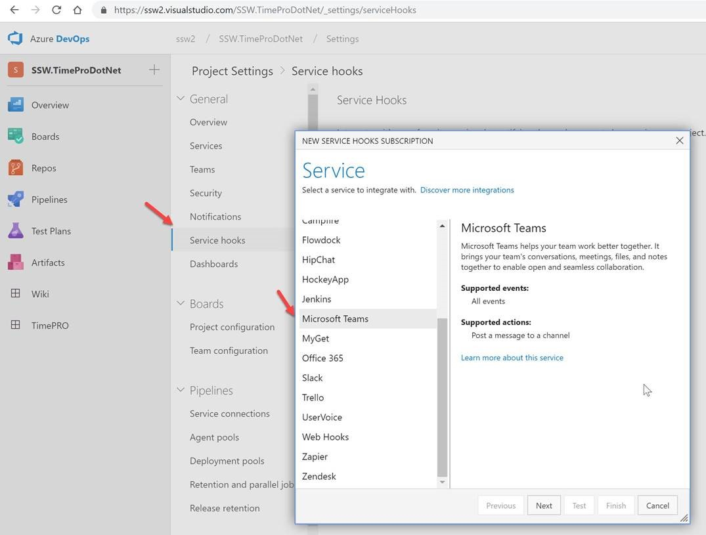

You can see details about your Azure DevOps Server (formerly known as TFS) projects directly in your Microsoft Teams channel. Examples of what you can monitor:

* Work item updates
* Pull requests
* Code commits
* Builds
* Release deployments and approvals

Also bring your Azure DevOps Services Kanban board directly into Microsoft Teams as a tab.

For more info, follow this link: https://docs.microsoft.com/en-us/azure/devops/service-hooks/services/teams?view=vsts

<!--endintro-->
<dl class="image">&lt;dt&gt;&lt;/dt&gt;<dd>Figure: How to setup Azure DevOps Events on Microsoft Teams </dd></dl><dl class="image">&lt;dt&gt;&lt;/dt&gt;<dd>Figure: It's nice to be able to converse about the project and see notifications such as PR coming through</dd></dl>
