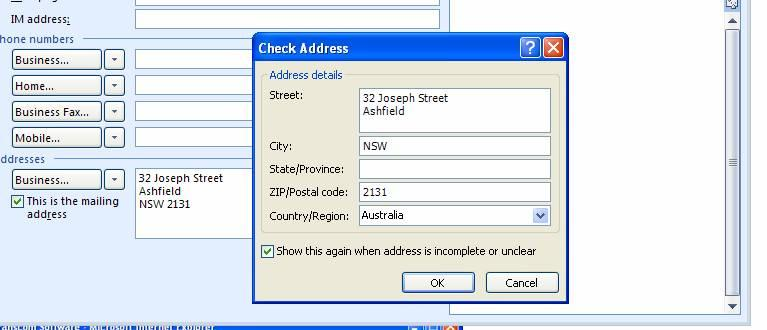
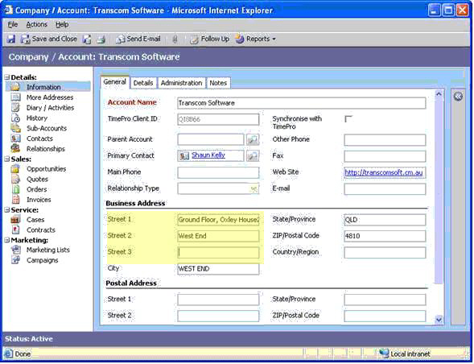

In Outlook the Street Address is stored as 1 Multi-Line field (with an 
intelligent Address Checker - nice but not essential), yet in Microsoft 
CRM the Street Address is split out across 3 separate single line text 
fields, they should be consistent.

 <excerpt class='endintro'></excerpt> 
<dl class="goodImage"><dt> 
       
   </dt><dd>Figure: Street Address in Outlook.</dd></dl><dl class="badImage"><dt> 
       
   </dt><dd>Figure: Street Address in CRM.</dd></dl>
 We consider Outlook is friendlier, because:
<ol><li>The wrong data is entered often when you have Street 1, Street 2, Street 3.</li><li>Often Street 2 and Street 3 is not needed so it is extra clutter for no reason.</li><li>What do you do when you have Street 4.</li><li>It is the same as 
      <a href="http://www.ssw.com.au/SSW/Redirect/Live.htm">http://local.live.com/</a></li></ol>
Of course, we might be wrong, because:
<ol><li>Basically, it's not worth the effort - because it goes across multiple places in CRM like Leads and Opportunity (see test results from Adrian).</li><li>Printing labels might be simpler - sizes would be fixed.</li></ol>
We have a suggestion for CRM about this at 
   <a href="http://www.ssw.com.au/ssw/Standards/BetterSoftwareSuggestions/CRM.aspx#AddressConsistent"> CRM and Outlook should be consistent with regards to Addresses.</a>

