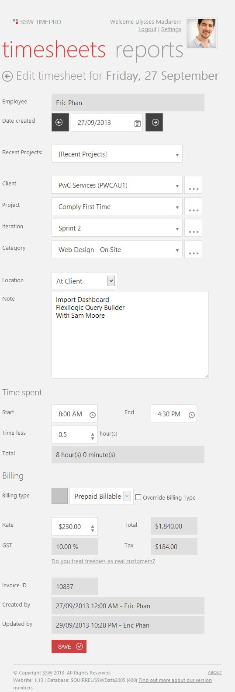

These are the essential fields for your timesheets:

<!--endintro-->

1. Client ID - or Client Name
2. "On-Site" or "Off-Site"
3. Project and Iteration (if applicable)
4. Category (what kind of work it is)
5. Amount of time
6. Break - Minimum 1/2 hour break if you work more than 5.5 hours
7. Notes - Things you've worked on, including people who you were working with - both internal or external

::: good

:::
