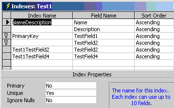

 
**Figure: A table with fields with multiple key indexes where the total size of the fields adds to more than 450 characters** 

::: yellowBox
[Upsizing PRO](http://www.ssw.com.au/ssw/UpsizingPRO) will check this rule
:::

<!--endintro-->
