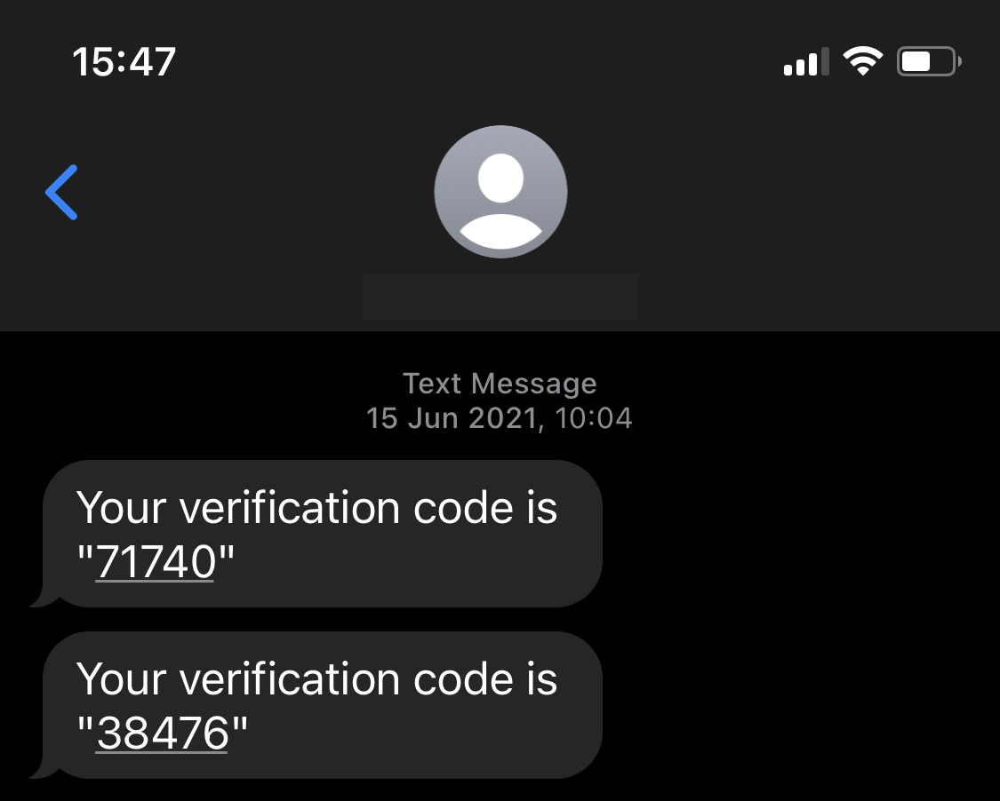
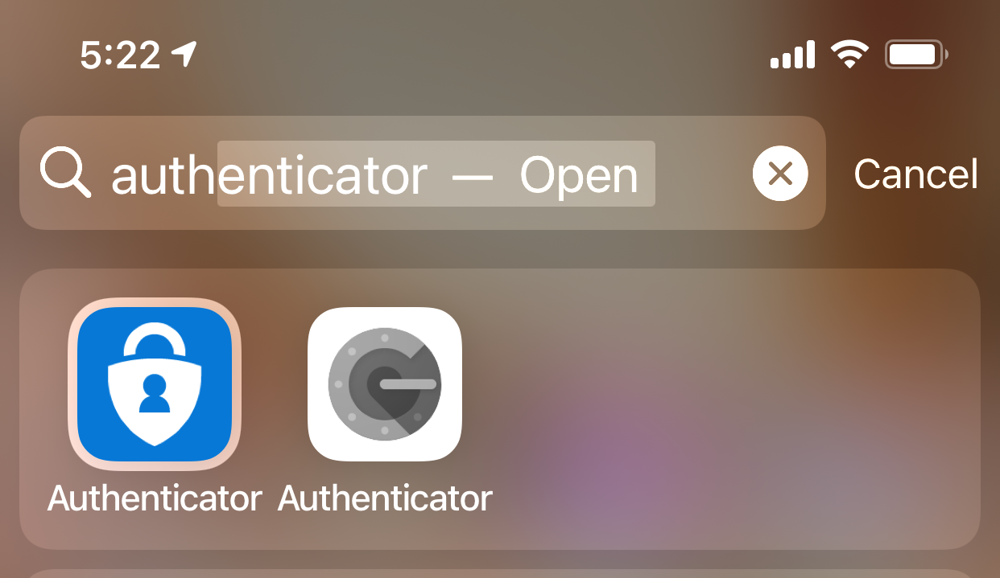

Do you protect your users and administrator accounts with more than one authentication method?

<!--endintro-->

What is Multi-Factor Authentication (MFA)?

MFA is another layer of security for your users and administrators, it adds another code or approval that you can receive in a device that you possess - a phone, for example - to make it more difficult for attackers to steal your account.
If they guess or brute-force your password, they still need the second code or approval to make it to your account.

Generally, every time you log in on a service, it will ask for your normal password and an additional code or approval. This can be retrieved through:

* An authenticator app **(recommended)**
* Email **(OK)**
* SMS **(less secure)**
* Phone call **(less secure)**

It is best practice to apply MFA to your Administrators first, as their accounts are the most important on the company and have access to all resources, and your users second, which still benefits from added security.

:::bad

:::

:::good

:::