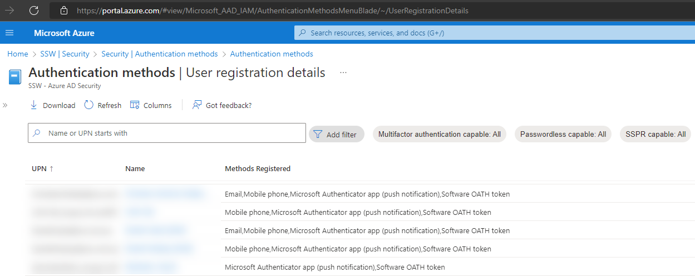
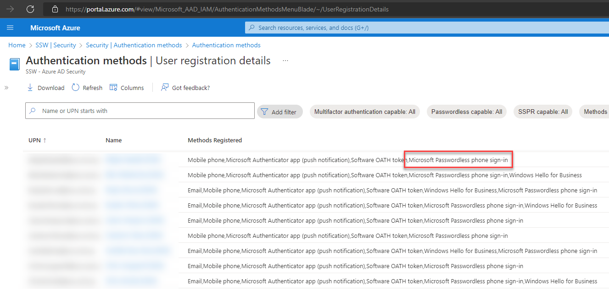

You should protect your users and administrator accounts with **more than one** authentication method.

<!--endintro-->

### What is Multi-Factor Authentication (MFA)?

MFA is another layer of security for your users and administrators, it adds another code or approval that you can receive in a device that you possess - a phone, for example - to make it more difficult for attackers to steal your account. If they guess or brute-force your password, they still need the second code or approval to make it to your account. 

Generally, every time you log in on a service, it will ask for your normal password and an additional code or approval. This can be retrieved through:

* RECOMMENDED - An authenticator app with passwordless **(secure)**
* An authenticator app with password **(secure)**
* A hardware token/key **(secure)**
* Email, SMS, or phone call **(less secure)**

### MFA in Microsoft 365

If you have Microsoft 365 Premium, Azure P1 or higher licensing you should use Conditional Access to set up MFA - read more about conditional access here: [Do you use Conditional Access policies?](/conditional-access-policies)

Once MFA is set up, you can see which method your users are using - go to **Azure AD | Security | Authentication Methods | User registration details**.

* Under **Default authentication method**, you want to see **Microsoft Authenticator app**
* Under **Methods Registered**, you also want to see **Microsoft Passwordless phone sign-in**

::: bad  

:::

::: good  

:::
