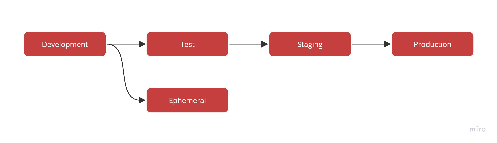

It is important to separate production and non-production environments. Some companies skip the non-production environments because it can be a hassle to copy new files, register DLLs and deploy backend changes. This will usually result in higher support costs and unhappy users due to simple bugs that could have been found in testing.  

<!--endintro-->

# What is each environment for?

* **Production**: Real data being used by real customers
* **Staging**: 'Production-like' data.  Used for testing and verification before deploying to Production.  Should have 'production-like' access (i.e. avoid giving devs admin rights).  Should generally have the same specs as production (especially during performance testing).  However, this is not always the case due to cost implications.
* **Test**: Internal environment used by the development team.  Hosted in the same place as the Staging & Production environments.  Access usually not provided to the client.
* **Ephemeral**: Special environment that is spun up on demand for testing of a branch.
* **Development**: Developer environment running on their local machine.  Also, sometimes called 'Local'.

# Large or Multi-Team Projects

For large projects it's recommended to run 3 hosted environments + local:

* Production
* Staging
* Test
* Development

# Internal or Small Projects

For smaller projects we can often get away without having a dedicated test environment.  In this scenario we have 2 hosted environments + 1 local.

* Production
* Staging
* Development

# Managing environments

::: greybox
The old solution is to use build scripts (.bat and .vbs files) to automatically create a setup package that can be used to deploy to development, staging, and production environments. For backend changes, you can either include the change scripts with the setup package (if it's a localised database), or run those scripts as part of your deployment process.

Read more about setup packages at [SSW's Wise Standard for Products.](http://www.ssw.com.au/ssw/Standards/wisesetup/WiseStandards.aspx)
:::

::: bad
Bad Example - using scripts to deploy your product to different environments
:::

::: greybox
The best way to manage your product across different environments is to use DevOps tools (like Azure DevOps, GitHub Actions, and others) and Infrastructure as Code (IaC).

For more information, see our rule: [Do you know how to create Azure resources?](/azure-resources-creating).
:::

::: good
Good Example - use DevOps tools and IaC to deploy to different environments
:::

You should also place the resources for each environment into its own Resource Group, and the resource group should have a tag to easily identify which environment the Resource Group relates to.

For more information, see our rule: [Do you apply tags to your Azure Resource Groups?](/apply-tags-to-your-azure-resource-groups).

# Make each environment visually distinct

Whenever an application has a UI, it's recommended to make it obvious which environment it's running on.  This can be done in several ways:

* Add the environment name to the header or footer of the website
* Give the environment a color theme to make it super obvious