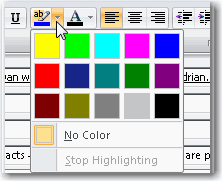

It is important to maintain three separate environments for development, testing and production. Some companies skip the testing server because it can be a hassle to copy new files, register DLLs and deploy backend changes. This will usually result in higher support costs and unhappy users due to simple bugs that could have being found in testing.

 <excerpt class='endintro'></excerpt> 

  
The best solution is to use build scripts (.bat and .vbs files) to automatically create a setup package that can be used to deploy to testing and production environments. For backend changes, you can either include the change scripts with the setup package (if it's a localised database), or run those scripts as part of your deployment process.

Read more about setup packages at <a href="http://www.ssw.com.au/ssw/Standards/wisesetup/WiseStandards.aspx">SSW's Wise Standard for Products.</a>

<strong>Now make each environment clear.</strong> 

Whenever an application has a database, have a visual indicator. I recommend a different background color for each environment 

<ul>
    <li>Red for the <strong>Development</strong> database </li>
    <li>Yellow for the <strong>Test</strong> database </li>
    <li>Grey (no colour) for the <strong>Production</strong> database </li>
</ul>

Note: The Yellow might have been Orange (kind of like traffic lights) but the color palette in Word doesn't give Orange. 

Figure: colors in Word color palette 

This prevents testers from accidentally entering test data into the production version. 

<strong>Windows Forms Tip:</strong> Implement in the base form in the header  
<strong>ASP.NET (at least version 2.0) Tip:</strong> Implement in the master form in the header

 Figure: Spice up your environments with different colors 

An application of this rule is how we identify our CRM servers - see rule <a href="/do-you-identify-development-test-and-production-crm-web-servers-by-colors">Do you identify Development, Test and Production CRM Web Servers by colors?</a>

