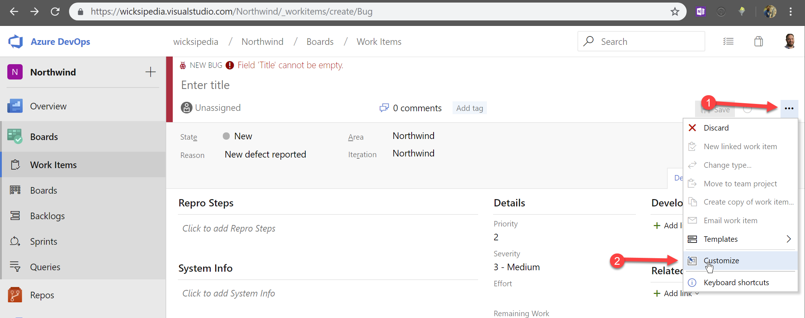
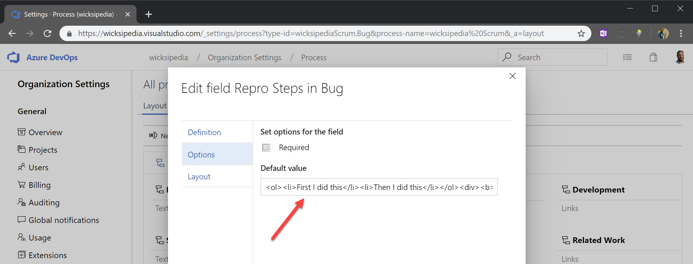

Often bugs are hard to reproduce because they are inconsistently described, and people forget to say what they expected to see. To increase consistency of bug reporting - it's a great idea to add templates for work items in Azure DevOps. It guides people into the pit of success as it helps them fill in all the required info in a clear and concise manner – then you will never see unclear steps to repro a bug again. 

<!--endintro-->


::: bad
Figure: Bad example – This new bug template doesn’t make it obvious how the team likes their steps to repro
:::


::: good
Figure: Good example – This new bug template guides the user to fill in the steps to repro in an ordered list and even prompts them to fill in what they expected to happen (and what actually happened)
:::

Setting this up is pretty easy:

1. First you need to customize the template for a work item type 
  

2. Choose the form control to edit
  

3. Save Template

### Sample template

```
<!-- These comments automatically delete -->
<!-- **Tip:** Delete parts that are not relevant -->
<!-- Next to Cc:, @ mention users who should be in the loop -->
Cc:
<!-- add intended user next to **Hi** -->
Hi 

### Describe the Bug
<!-- A clear and concise description of what the bug is. -->

### To Reproduce
Steps to reproduce the behavior:
1. Go to '...'
2. Click on '....'
3. Scroll down to '....'
4. See error

### Expected Behavior
<!-- A clear and concise description of what you expected to happen. -->

### Tasks
- [ ] Investigate
- [ ] Fix

### More Information
<!-- Add any other context about the problem here. -->

### Environment
 - Device: [e.g. iPhone 12]
 - Browser: [e.g. chrome, safari]
 - OS: [e.g. iOS]

### Screenshots
<!-- If applicable, add screenshots to help explain your problem. -->


Thanks!
```