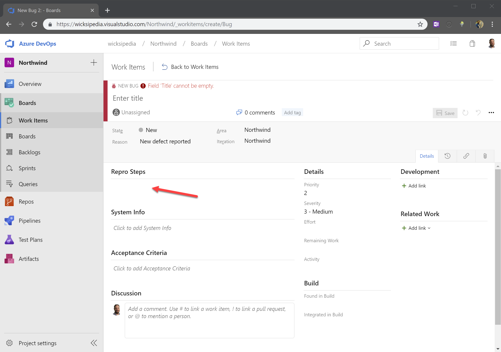
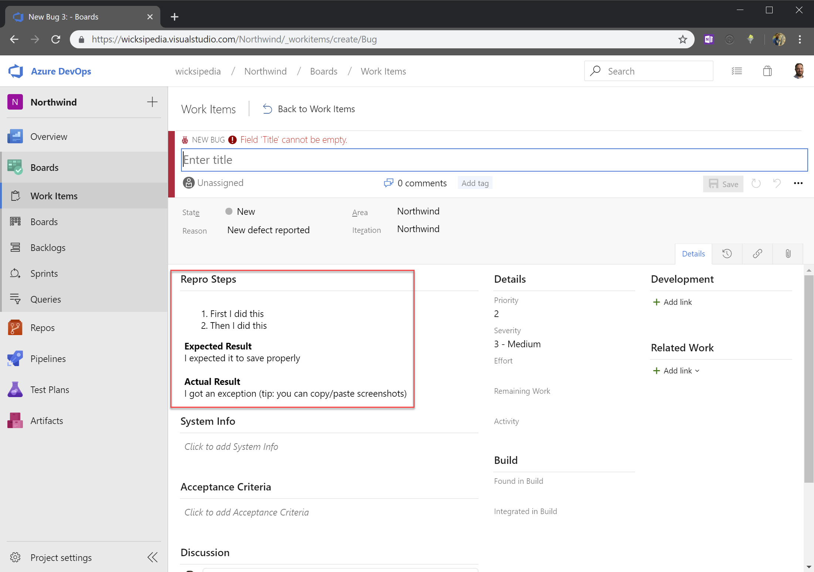

<!--endintro-->

Often bugs are hard to reproduce because they are inconsistently described, and people forget to say what they expected to see. To increase consistency of bug reporting - it’s a great idea to add templates for work items in Azure DevOps. It guides people into the pit of success as it helps them fill in all the required info in a clear and concise manner – then you will never see unclear steps to repro a bug again.

::: bad
Figure: Bad Example – This new bug template doesn’t make it obvious how the team likes their steps to repro\
:::

::: good
Figure: Good Example – This new bug template guides the user to fill in the steps to repro in an ordered list and even prompts them to fill in what they expected to happen (and what actually happened)\
:::

Setting this up is pretty easy.

1. First you need to customise the template for a work item type !\Figure: Customising a bug work item
2. Choose the form control to edit

Figure: Customising a bug work item form</dd>

3. Choose the form control to edit !\**Figure: Set the default value for the Repro Steps field (tip: use HTML)**
4. Save Template

Sample Template:

::: greybox
&lt;ol&gt;&lt;li&gt;First I did this&lt;/li&gt;&lt;li&gt;Then I did this&lt;/li&gt;&lt;/ol&gt;&lt;div&gt;&lt;b&gt;Expected Result&lt;/b&gt;&lt;/div&gt;&lt;div&gt;I expected it to save properly&lt;/div&gt;&lt;div&gt;&lt;b&gt;&lt;br&gt;&lt;/b&gt;&lt;/div&gt;&lt;div&gt;&lt;b&gt;Actual Result&lt;/b&gt;&lt;/div&gt;&lt;div&gt;I got an exception (tip: you can copy/paste screenshots)

:::