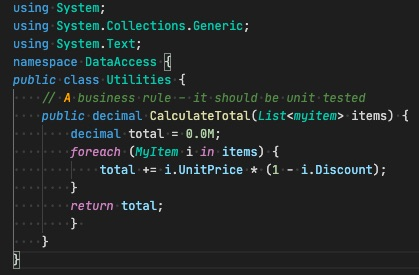
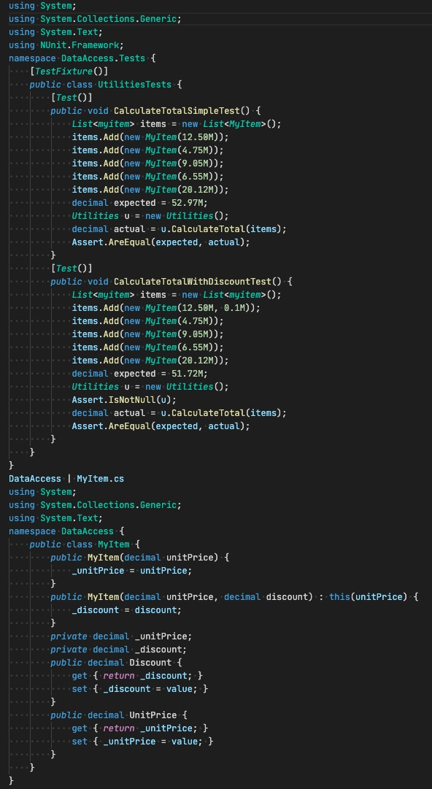

By difficult to spot errors we mean errors that do not give the user a prompt that an error has occurred. Things such as: Arithmetic, Rounding or Regular Expressions should have unit tests written for them.

<!--endintro-->

Sample Code:

For a function like this, it might be simple to spot errors when there are one or two items, but if you were to calculate the total for 50 items, then the task of spotting an error isn't so easy. That's why a unit test should be written so that you know when the function doesn't work.

**Sample Test:**

**

**
 **Figure: Test calculates total by checking something we know the result of. (Note: it doesn't need a failure case because it isn't a Regex.)
**
