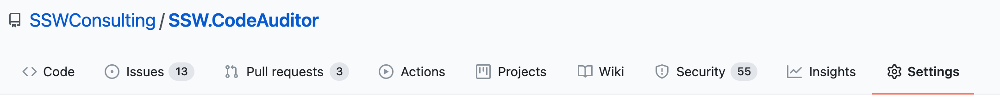
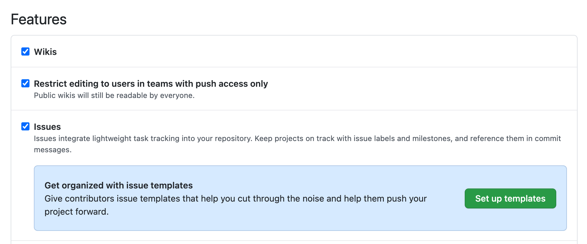
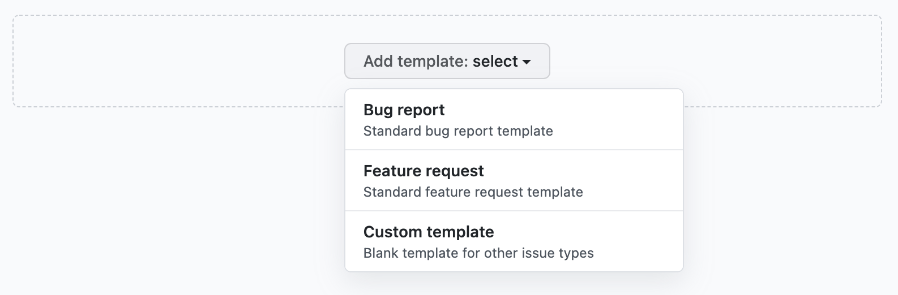
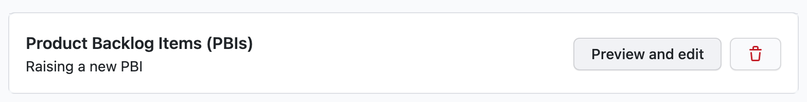
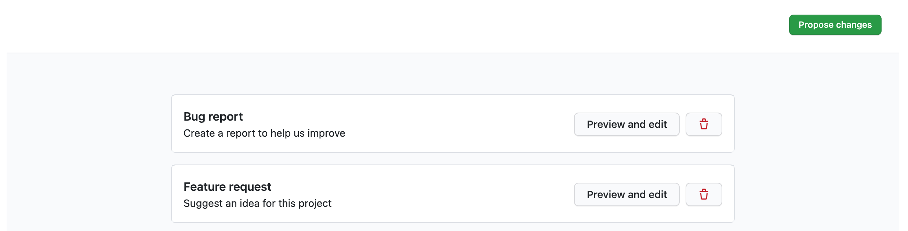
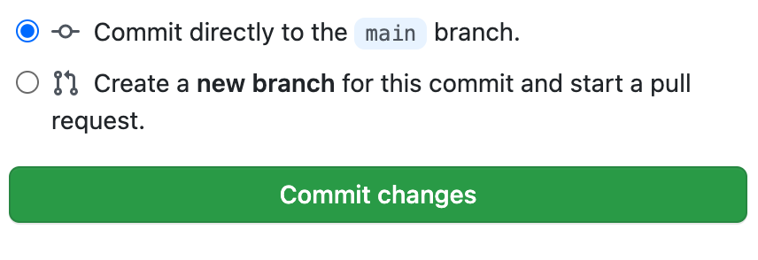

### Do you have the best GitHub Issue template

GitHub issues (classic) offers a great way of raising issues within the projects. However, it can be difficult to distinguish whether the issue is about a bug fix, feature request or just a topic question.
Therefore, GitHub issue templates should be used to help standardize and categorize different issue queries

<!--endintro-->

Based on [Configuring issue templates for your repository](https://docs.github.com/en/communities/using-templates-to-encourage-useful-issues-and-pull-requests/configuring-issue-templates-for-your-repository)

See [SSW Github issues template](https://github.com/SSWConsulting/ssw.github.template) to view our standard configured issue templates

To create GitHub issues templates

1. On GitHub, navigate to the main page of the repository.

2. Under your repository name, click  Settings.

3. In the "Features" section, under "Issues," click Set up templates.

4. Use the Add template drop-down menu, and click on the type of template you'd like to create.

5. To preview or edit the template before committing it to the repository, click Preview and edit.

6. When you're finished editing and previewing your template, click Propose changes in the upper right corner of the page.

7. Then finally click **Commit changes**. 
Once these changes are merged into the default branch, the template will be available for contributors to use when they open new issues in the repository.

