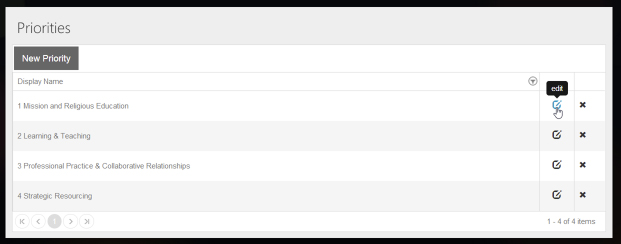
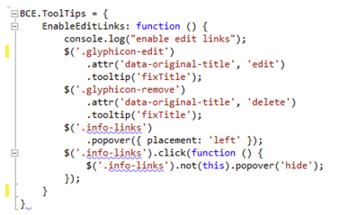

Icons make your user interface clean, but users sometimes need further information about the operation they are about to perform.​

 <excerpt class='endintro'></excerpt> 
<dl class="goodImage"><dt> 
       
   </dt><dd>Figure: Good Example - Tooltips</dd></dl><dl class="image"><dt> 
       
   </dt><dd>Figure: When adding Kendo Tooltips to Icons in the Kendo Grid, the Tooltip JavaScript needs to be executed as the page is bound or else the tooltips will not exist after a new page of data is selected</dd></dl><dl class="image"><dt> 
       
   </dt><dd>Figure: Common JavaScript library: add the EnableEditLinks() method/dd&gt; </dd></dl>

