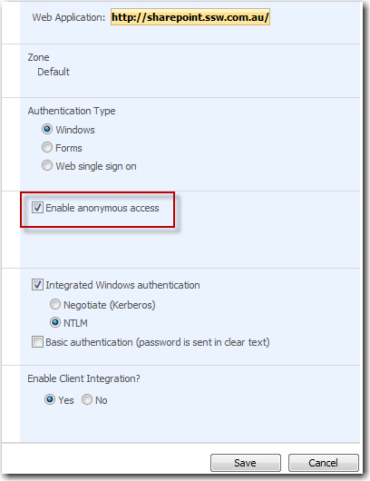
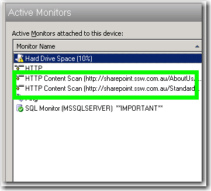

Any configuration settings, that you rely upon, must have a check so you get an email as soon as the problem arises. Eg.
An anonymous access check - A web publishing site needs a check to make sure anonymous access is configured correctly.

Figure: Enable anonymous access for publishing site
Figure: monitors for anonymous access - If the monitor is down, there will be an email sending out to our network admins

<!--endintro-->
