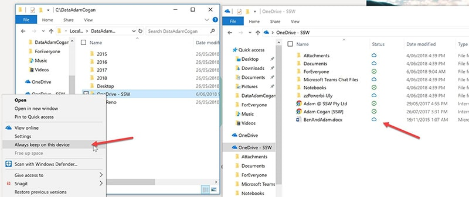

Check "Always keep on this device" so you can access your files offline.

<!--endintro-->
<dl class="badImage">&lt;dt&gt;  &lt;/dt&gt;<dd>Figure: Bad example - By default you cannot open your files when you have no internet</dd></dl> <dl class="image"> &lt;dt&gt;  &lt;/dt&gt;<dd>Figure: So check "Always keep on this device"</dd></dl><dl class="goodImage">&lt;dt&gt;  &lt;/dt&gt;<dd>Figure: Good example – you can now open offline    </dd></dl>
