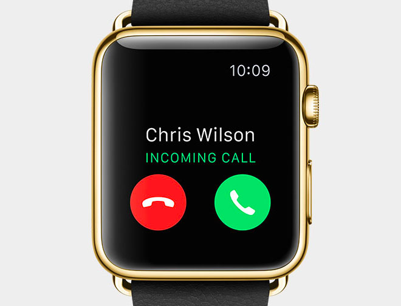
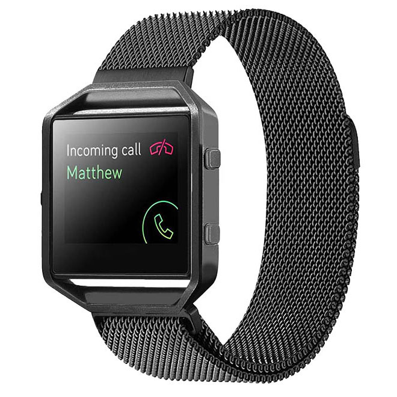
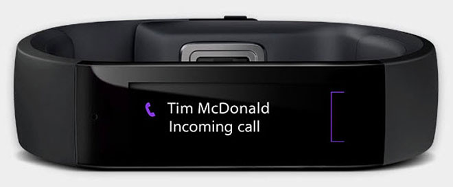

​​If you were talking to someone, when their phone rang; would you want them to answer it? If they were using a loud ringtone, the only way to continue your conversation would be to wait until they had finished or, at least, they would have to get their phone out to hang up. Why should the person who called get preferential treatment and be able to jump the queue? 
 

Your mobile phone is a very useful tool. However, it can also be a nuisance. To make sure it doesn't interrupt your daily activities, you should always put it in silent mode.

 If you have a wearable device like an Apple Watch/ Fitbit/ Microsoft Band that connects to your phone, your wrist vibrates when you receive a call. This alerts you to your incoming call silently even if you are not near your phone, and means you *never* need to have your phone on anything but VIBRATE. Microsoft Bands also have the added advantage of allowing you to send a text message-based quick response right from the device letting your caller know you are busy.  

 <excerpt class='endintro'></excerpt> 
<dl class="image"><dt>  </dt><dd>Figure: With an Apple Watch, you can keep your phone on vibrate 100% of the time and never have to worry about missing a call</dd></dl><dl class="image"><dt>  </dt><dd>Figure: With a Fitbit, you can keep your phone on vibrate 100% of the time and never have to worry about missing a call </dd></dl><dl class="image"><dt>  </dt><dd>Figure: With a Microsoft Band, you can keep your phone on vibrate​ 100% of the time and never have to worry about missing a call</dd></dl>
This has the following advantages:
<ul><li>You get to only answer the phone when it is convenient for you</li><li>You won't be interrupting conversations with clients, which can be seen as unprofessional</li><li>You don't interrupt people's work with loud ringtones </li></ul>

<iframe width="800" height="450" src="https://www.youtube.com/embed/vwBzLLbE738?rel=0" frameborder="0"></iframe> 
 

<dd class="ssw15-rteElement-FigureNormal">Figure: Should the person you’re meeting get priority...or the person ringing in?​ </dd>

