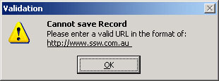
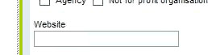

Most developers seem to validate a URL and tell the user what they have done wrong only after the error happens. URL fields should show how the users must enter it.

<!--endintro-->

::: bad  
  
:::

The better way is to have the user avoid the error with a good default.

::: bad  
  
:::

::: good  
  
:::
