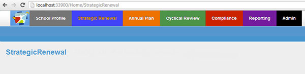
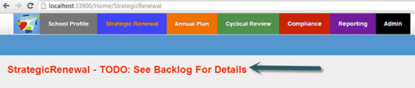
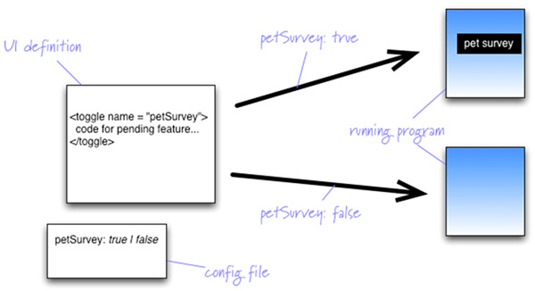

It is important that users of your application who provide feedback  have very clear indications of work that is not yet complete, to avoid  feedback on sections of your application that are still under  development.

<!--endintro-->

Also, see our     [rule on colour usage in windows forms](http://www.ssw.com.au/ssw/Standards/rules/rulestobetterwindowsforms.aspx#RedYellowDesigner).
<dl class="badImage">&lt;dt&gt;
      
   &lt;/dt&gt;<dd>Figure: Bad Example - A tester or a product owner who comes to this page may believe that it is broken, or that the developers have 'missed' it. Always be clear about what parts of your application are not yet ready for feedback</dd></dl><dl class="goodImage">&lt;dt&gt;
      
   &lt;/dt&gt;<dd>Figure: Good Example - It is clear to testers and to the product owner that this page is incomplete, but they can get more details from the product backlog</dd></dl><dl class="goodImage">&lt;dt&gt;
      
   &lt;/dt&gt;<dd>Figure: Best Example - Use feature toggles to not show incomplete elements to testers or product owners. See 
      <a href="http://martinfowler.com/bliki/FeatureToggle.html" target="_blank">FeatureToggle by Martin Fowler</a>. Feature Toggling can require a large amount of extra work and so is often only implemented by teams with a need to ship features while others are still in development</dd></dl>
#### Related Rule

* [Do you use red and yellow colours to distinguish elements in the Designer?](http://www.ssw.com.au/ssw/Standards/rules/rulestobetterwindowsforms.aspx#RedYellowDesigner)
