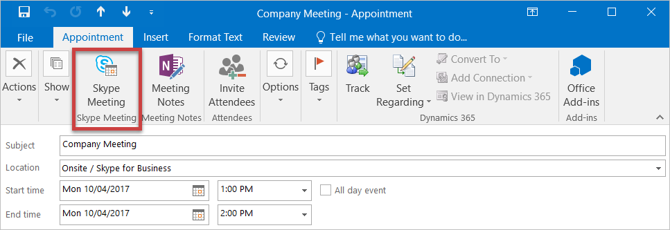

One risk of running a consulting company is your employees can start to feel disconnected from the main organization, especially if they spend all of their time working onsite. One solution is to get them to work from the office at least once or twice per week, and another is to hold regular company meetings.

<!--endintro-->

These meetings should be held every 1-2 months as needed, and give the chance for everyone to get together and reconnect. The business owner can highlight any key things that have happened in that time and point out any changes for the next period.

There may also be time for a couple of other people to address everyone if there are any key things that need to be brought up.

So that it doesn't impact client work too much, it's generally best if this meeting can be timeboxed to about 1 hour and be held over lunch.

After each meeting, the organizer should set the date for the next one and send out an appointment with a "Skype Meeting" request, so available people can simply click the "Join Meeting" link to join, as this saves time and makes the beginning of the meeting run smoothly.

::: good

:::

::: email-template  
|          |     |
| -------- | --- |
| To:      | SSWAll |
| Subject: | Join us for the company meeting |  
::: email-content  

### Hi All  

(Emailed SSWChapel@ to book it in its calendar)

Join us for the next company meeting. We generally try to hold these every few months to keep everyone connected and up-to-date.

If you’re at SSW Sydney on the day, come to the SSW Chapel, otherwise, click the link below to join the Teams meeting

Let me know if you want any topics raised.

&lt;This is as per the rule [https://ssw.com.au/rules/do-you-hold-regular-company-meetings/](/do-you-hold-regular-company-meetings) &gt;

:::  
:::  
::: good
Figure: Good example - Email template for the meeting
:::
