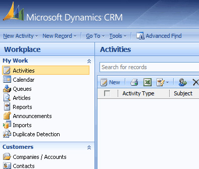

As per rule <a href="/_layouts/15/FIXUPREDIRECT.ASPX?WebId=3dfc0e07-e23a-4cbb-aac2-e778b71166a2&TermSetId=07da3ddf-0924-4cd2-a6d4-a4809ae20160&TermId=ae2ccef9-6cdc-4767-8e5a-e0e3dbf46fe2"> "Do you have separate development, testing, and production environment?"</a>, it's better to use different background colors to identify Development, Test and Production servers. 
<h3 class="ssw15-rteElement-H3">CRM  </h3><dl class="image"><dt></dt><dd>Figure: Staging uses blue background</dd></dl><dl class="image"><dt> </dt><dd>Figure: Production uses red background </dd></dl>
The way to change the default background color is to edit the CRM CSS files. These changes aren't supported and may be overwritten when CRM Rollups are applied. 
<h3 class="ssw15-rteElement-H3">CRM 2015 and CRM 2016 </h3>
Using theme feature to change the environment color.
<dl class="image"><dt></dt><dd>Figure: Changing CRM 2016 UI by using theme feature </dd></dl><h3 class="ssw15-rteElement-H3">CRM 2013</h3>
Edit: <strong>&lt;CrmWebsiteRoot&gt;</strong><strong>\_controls\navbar\navbar.css</strong>

.navigationControl { background-color: #006600; margin: 0; z-index: 999; float: left; width: 100%; position: relative; }
<dd class="ssw15-rteElement-FigureNormal"> Figure: Edit the background color to reflect the environment </dd><dl class="image"><dt></dt><dd> Figure: CRM 2013 with a green navigation bar</dd></dl> 
 <excerpt class='endintro'></excerpt> 
<h3 class="ssw15-rteElement-H3">CRM 2011</h3>
Edit 
   <strong>&lt;CrmWebsiteRoot&gt;\_static\css\1033\cui.css</strong>, locate and modify the section ms-cui-tabBody so that it reads:

   background-color : #ffffff;

Change color to a suitable color for the environment:

   background-color : #bbffaa; 

  

   Figure: CRM Ribbon color green to signify production environment
<h3 class="ssw15-rteElement-H3">CRM 4</h3>
Edit,<strong> &lt;CrmWebsiteRoot&gt;\</strong><strong>_common\styles\global.css.aspx</strong>
<dl class="image"><dt>
<pre>         body.stage
            {
                &lt;% if (CrmStyles.IsRightToLeft) { %&gt;
                    dir:rtl;
                &lt;%} %&gt;
                border-top:1px solid #6893cf;
​​
            /* background-color: #d6e8ff; */

            background-color: #ffff00;

            padding: 4px;
            
            /* background-repeat: repeat-x;
            
            background-image: url(/_imgs/app_back.gif);
                  */
            }
       </pre>
</dt><dd> Figure: In C:\Inetpub\wwwroot\_common\styles\global.css.aspx comment out and change the reference in yellow so the users know what server they are on</dd></dl><dl class="image"><dt>
      
   </dt><dd>Figure: Color of CRM Development Server - Red</dd></dl><dl class="image"><dt>
      
   </dt><dd>Figure: Color of CRM Test Server - Yellow</dd></dl><dl class="image"><dt>
      
   </dt><dd> Figure: Color of CRM Production Server - Default </dd></dl><h3>SharePoint online</h3>
Regarding the color codes, we use to differentiate Production to Test with SharePoint online.

Here is what we change:
<ul><li>Site Settings | Change The Look 
      <ul><li>Test – Orange 
            <dl class="image"><dt> 
                   
               </dt><dd>Figure: Selecting Orange theme for test</dd></dl><dl class="image"><dt> 
                   
               </dt><dd>Figure: orange theme applied</dd></dl></li><li>Production - Office 
            <dl class="image"><dt> 
                   
               </dt><dd>Figure: Selecting Office theme for Production</dd></dl><dl class="image"><dt> 
                   
               </dt><dd>Figure: office (blue) theme applied</dd></dl></li></ul></li></ul>

