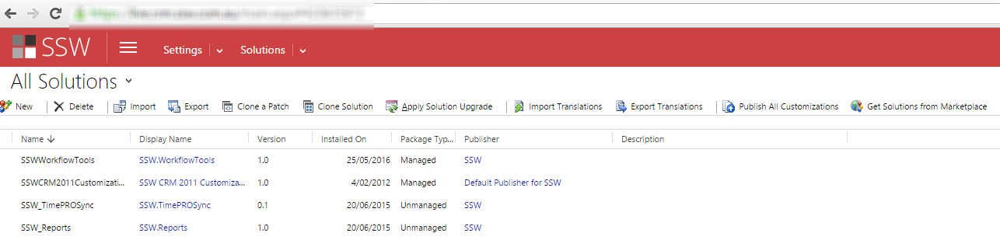
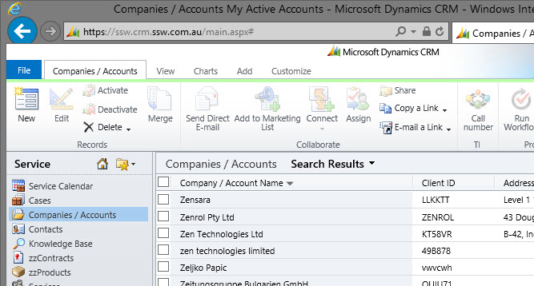
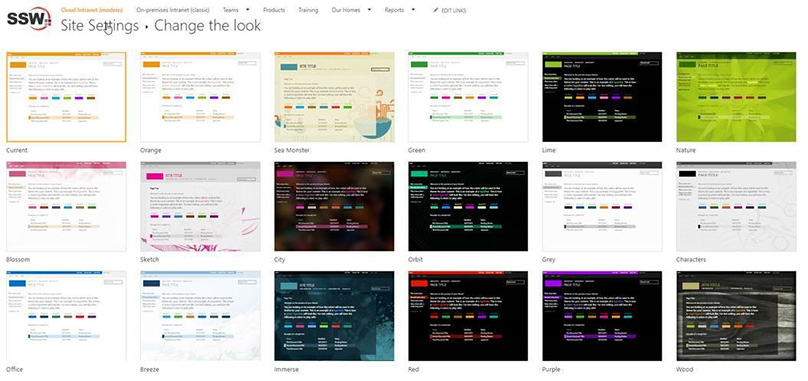
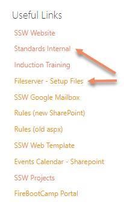
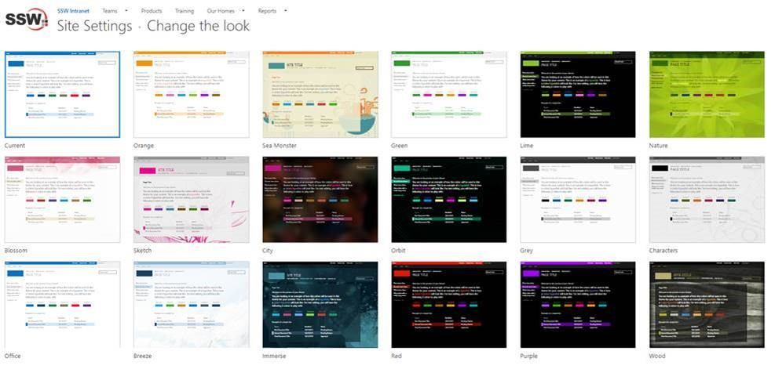

As per rule ["Do you have separate development, testing, and production environment?"](/do-you-have-separate-development-testing-and-production-environments), it's better to use different background colors to identify **Development**, **Test** and **Production** servers.

### CRM

  

  

The way to change the default background color is to edit the CRM CSS files. These changes aren't supported and may be overwritten when CRM Rollups are applied.

### CRM 2015 and CRM 2016

Using theme feature to change the environment color.

  

### CRM 2013

Edit `{{ CRM WEBSITE ROOT }}\_controls\navbar\navbar.css`:

``` css
.navigationControl
{
    background-color: #006600;
    margin: 0;
    z-index: 999;
    float: left;
    width: 100%;
    position: relative;
}
```

**Figure: Edit the background color to reflect the environment**

  

<!--endintro-->

### CRM 2011

Edit `{{ CRM WEBSITE ROOT }}\_static\css\1033\cui.css`, locate and modify the section ms-cui-tabBody so that it reads:

``` css
background-color : #ffffff;
```

Change color to a suitable color for the environment:

``` css
background-color : #bbffaa;
```



### CRM 4

Edit, `{{ CRM WEBSITE ROOT }}\_common\styles\global.css.aspx`

``` css
body.stage
{
    <% if (CrmStyles.IsRightToLeft) { %>
        dir:rtl;
    <%} %>
    border-top:1px solid #6893cf;

    /* background-color: #d6e8ff; */

    background-color: #ffff00;

    padding: 4px;
            
    /* background-repeat: repeat-x;

    background-image: url(/_imgs/app_back.gif);
    */
}
```

**Figure: In `C:\Inetpub\wwwroot\\_common\styles\global.css.aspx` comment out and change the reference in yellow so the users know what server they are on**

  

  

  

### SharePoint online

Regarding the color codes, we use to differentiate Production to Test with SharePoint online.

Here is what we change:

* Site Settings | Change The Look
* Test – Orange

  

  

### Production - Office

  


