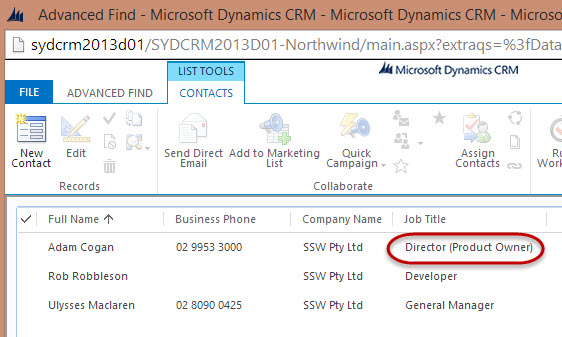

​​To make them easily identifiable​, the <a href="/_layouts/15/FIXUPREDIRECT.ASPX?WebId=3dfc0e07-e23a-4cbb-aac2-e778b71166a2&TermSetId=07da3ddf-0924-4cd2-a6d4-a4809ae20160&TermId=d3fc9341-c12c-465c-800b-c8575375d138">Product ​Owner</a>​ of a Company/Account should be included into their Job Title. 

 <excerpt class='endintro'></excerpt> 
<dl class="badImage">
          <dt></dt></dl><dl class="goodImage">
          <dd>
            Figure: Good Example -​ A CRM 2013 user can easily determine who is the Product Owner of the Company/Contact</dd>
        </dl>

