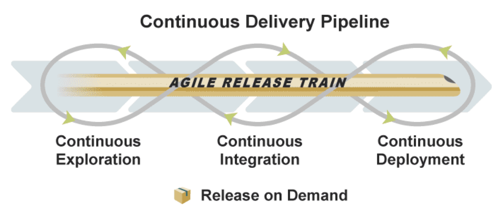

When development and operations teams operate in their separate bubbles, it's a recipe for deployment delays and mounting bottlenecks. Imagine developers crafting features at lightning speed, but the operations team is playing catch-up, trying to deploy them. This divide doesn't just create hiccups; it hinders the prompt delivery of new features and essential fixes. 

It's akin to a relay race where the baton handoff keeps tripping the runners. The solution? Merging these two worlds with DevOps practices focused on continuous delivery, ensuring a smooth and uninterrupted journey from development to deployment.

<!--endintro-->

## What is DevOps?

DevOps is more than just a buzzword; it's a transformative approach to the world of software delivery. At its core, DevOps blends the best of software development (Dev) and IT operations (Ops). 

But why merge these two? The answer lies in its objectives: to compress the system development life cycle, ensure continuous delivery with high software quality, and foster a culture of collaboration. In essence, DevOps aims to streamline processes, eliminate silos, and deliver value faster and more efficiently.

### Benefits of Implementing DevOps

**Speed**

In today's digital era, being first often means being the best. DevOps isn't just about speed for speed's sake; it's about staying ahead of the curve and outpacing competitors. By streamlining development and operations processes, DevOps acts as a catalyst, accelerating the journey from idea to deployment. 

This not only trims down your time to market but also positions your product or service at the forefront, ready to capture opportunities quicker than ever.

**Reliability**

Surprises in software delivery can be costly and disruptive. DevOps minimizes these unexpected issues. Automated testing identifies potential flaws early in the process, ensuring they're addressed well before deployment. Coupled with continuous monitoring, this vigilant oversight guarantees system robustness and resilience once live. 

The outcome? 

Deliverables that are not only swift but also steadfastly reliable, bolstering user satisfaction and trust.

**Collaboration**

The beauty of DevOps lies not just in merging processes, but also in bridging people. By breaking down silos and fostering an environment of open communication, DevOps brings development and operations teams closer than ever before. 

This enhanced collaboration means shared responsibilities, combined insights, and a unified approach to problem-solving. The outcome is a synergy where teams don't just work alongside each other, but truly together, leading to more innovative solutions and swifter resolutions.

::: greybox
Implement DevOps practices to streamline development and operations.
:::

::: good

:::

## Why Should You Implement DevOps?

### Seamless Integration

Traditionally, the handoff between development and operations could be a fraught moment, laden with potential hiccups and delays. However, with DevOps, these two critical phases intertwine seamlessly. This seamless integration ensures a smooth transition, eliminating the usual bottlenecks that can stall deployment. 

The outcome is a significantly reduced time from code completion to going live, ensuring that innovations reach the market swiftly and reliably.

::: greybox
Adopt DevOps for a seamless integration between development and operations.
:::

::: good

:::

### Risk Mitigation

In the realm of software delivery, risks can translate to downtime, user dissatisfaction, or even financial loss. DevOps is uniquely equipped to tackle these challenges head-on. By embedding continuous testing within the development cycle, potential pitfalls are detected and addressed long before they escalate. 

Additionally, with continuous monitoring in place, any post-deployment anomalies are promptly identified. Together, these practices drastically reduce the risks associated with deployments, ensuring a smoother and more reliable user experience.

::: greybox
Utilize DevOps for continuous testing and risk mitigation.
:::

::: bad

:::

## Conclusion

Embracing DevOps practices for continuous delivery goes beyond mere technical adjustments—it's a transformative cultural shift. By bridging the divide between development and operations teams, it fosters an environment of collaboration and shared purpose. 

The result? 

Deployments that are not only swifter but also more reliable and secure. In this landscape, the entire software development life cycle is supercharged, paving the way for enhanced efficiency and, ultimately, a more agile and responsive business.
