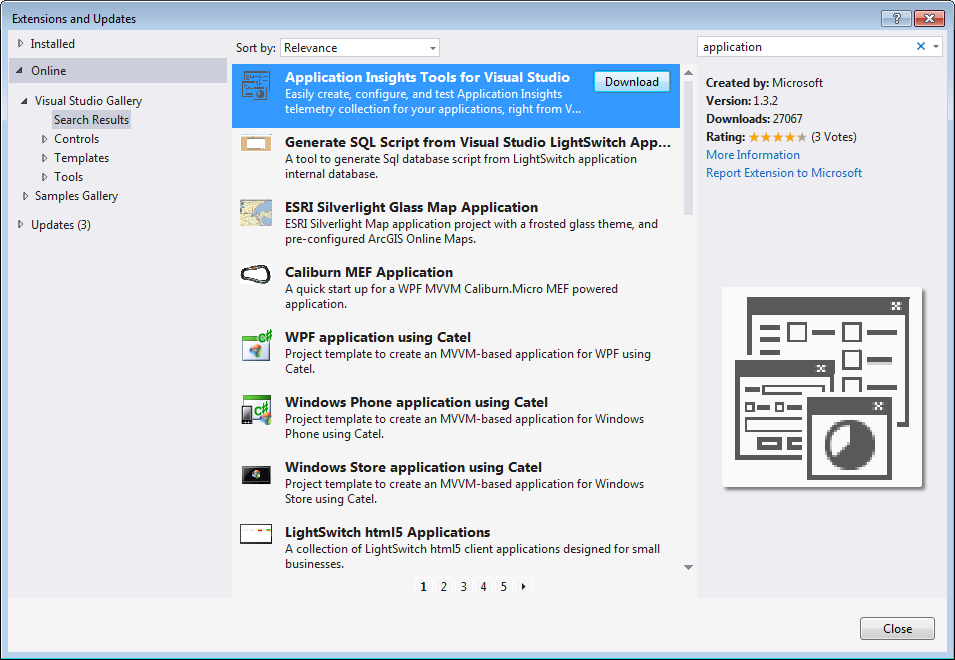
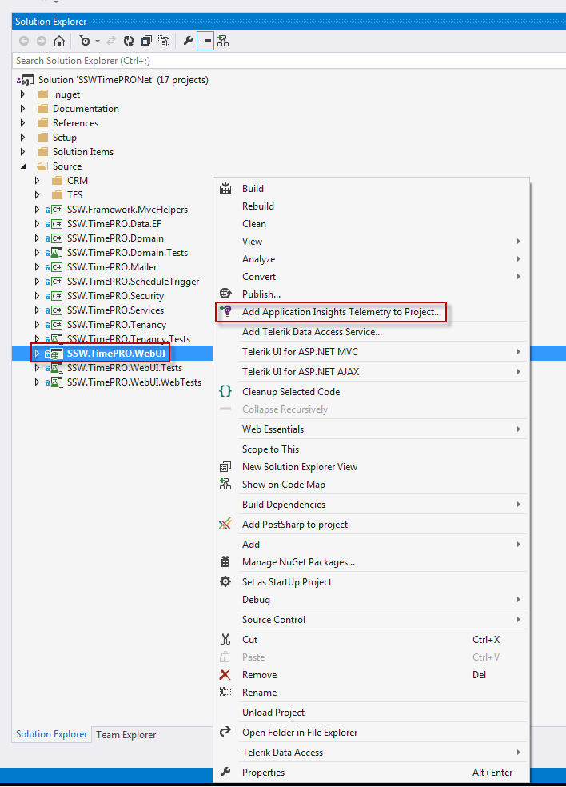
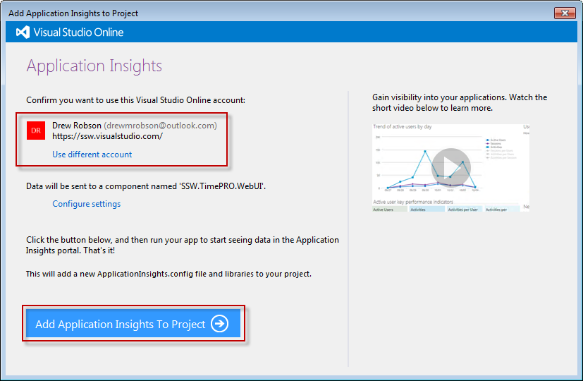
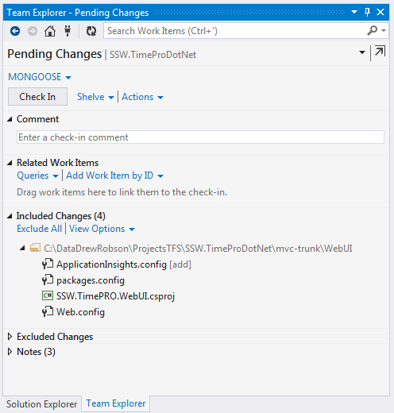
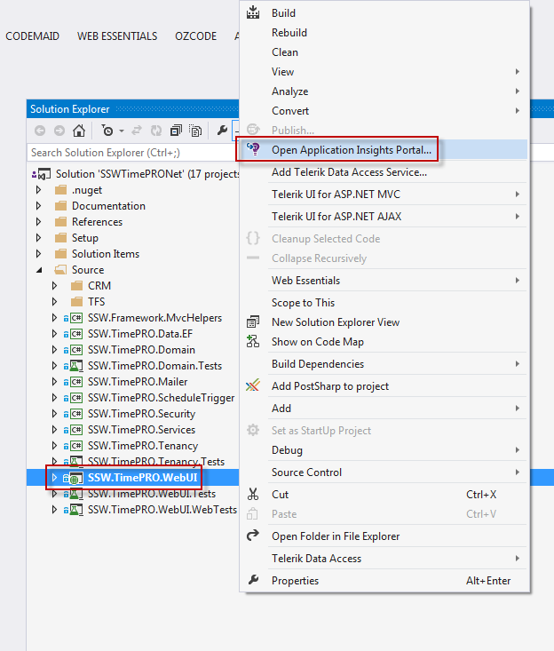
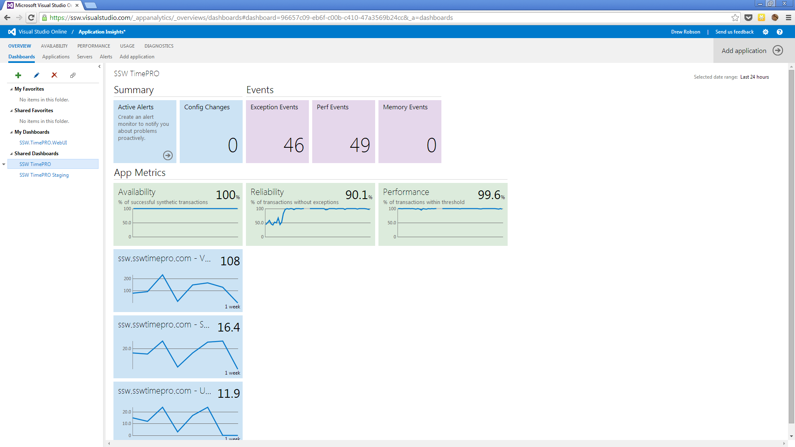
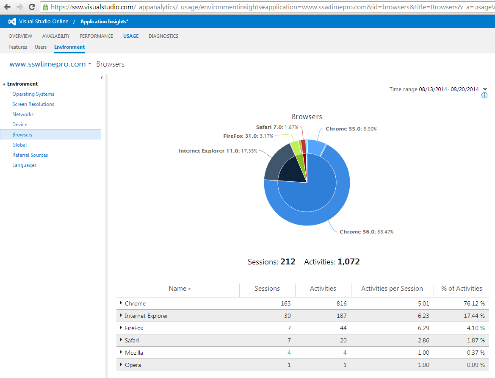
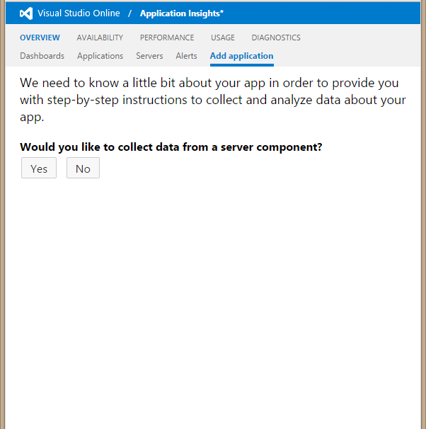
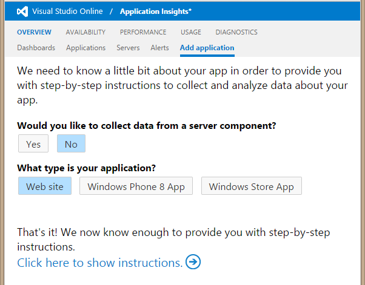
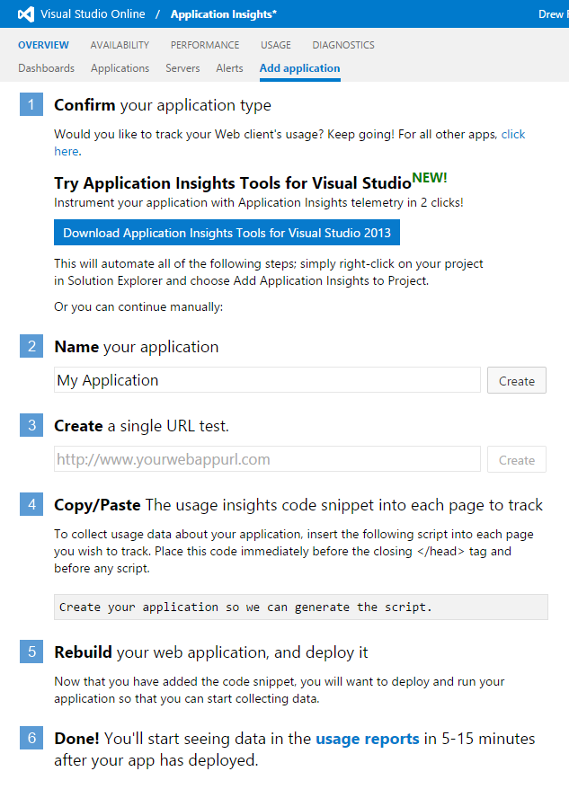

​​​​​​​​​​Application Insights for Visual Studio Online gives you a great insight into how, when and where your website is used.
 <excerpt class='endintro'></excerpt> 

​

If you're not using an analytics package in your website, you're flying blind when it comes to understanding how, when and where your webiste is used. 

To add Application Insights to your website, follow these steps.

 <strong>Figure: In Visual Studio, go to Tools | Extensions and Updates... and download Application Insights Tools for Visual Studio</strong>

<strong> </strong>

 <strong>Figure: Once Visual Studio has been restarted, open your solution. Right-click on your web project and select Add Application Insights Telemetry to Project...</strong>

(Add Application Insights Telemetry to Project... not displaying? See instructions at the end of this rule)

 <strong>Figure: </strong><strong>Sign in with your VSO account if required. Then click Add Application Insights To Project</strong>

 

 <strong>Figure: This will update your project with the NuGet package and settings to include Application Insights in your project. Check this in and deploy your website.</strong>

 

​ <strong>Figure: Now when you right-click on your web project there is a new option Open Application Insights Portal...</strong>

<strong> </strong>

 <strong style="line-height:20.7999992370605px;">Figure: Dashboard showing summary and application metrics​</strong>  

 

Once deployed, Application Insights will start tracking metrics and interacting with your Visual Studio Online dashboards.

Application Insights tracks a lot of metrics in your website but one of the most useful is the breakdown of visits by each browser (IE, Chrome etc).

 <strong>Figure: Breakdown of which browsers are used to access your website</strong>

<strong>Note: </strong> Make sure Server Performance Monitoring is set up (currently not available for Azure Websites)

 

<strong>Figure: Ensure you complete this process to add Server Monitoring</strong>

Sometimes you will be trying to add Application Insights to an existing project and the context menu item will not be there. There is a manual way to add Application Insights if this is the case.

 <strong>Figure: Sign into Visual Studio Online, and navigate to Application Insights | Add Application</strong>

 

 <strong>Figure: Use these settings to generate the manual instructions</strong>

 

 <strong>Figure: Follow these steps to add the Application Insights JavaScript code to your website</strong>

 

