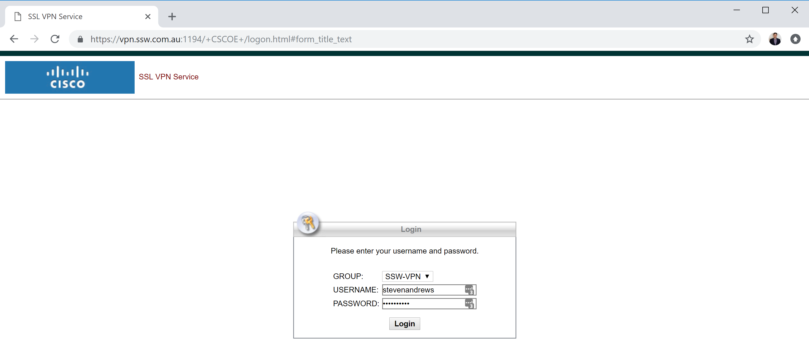

Application Insights for Visual Studio Online gives you a great insight into how, when and where your website is used. 
<!--endintro-->

If you're not using an analytics package in your website, you're flying blind when it comes to understanding how, when and where your webiste is used.

To add Application Insights to your website, follow these steps.

**
**

(Add Application Insights Telemetry to Project... not displaying? See instructions at the end of this rule)

**
**

Once deployed, Application Insights will start tracking metrics and interacting with your Visual Studio Online dashboards.

Application Insights tracks a lot of metrics in your website but one of the most useful is the breakdown of visits by each browser (IE, Chrome etc).

**Note:** Make sure Server Performance Monitoring is set up (currently not available for Azure Websites)

Sometimes you will be trying to add Application Insights to an existing project and the context menu item will not be there. There is a manual way to add Application Insights if this is the case.

