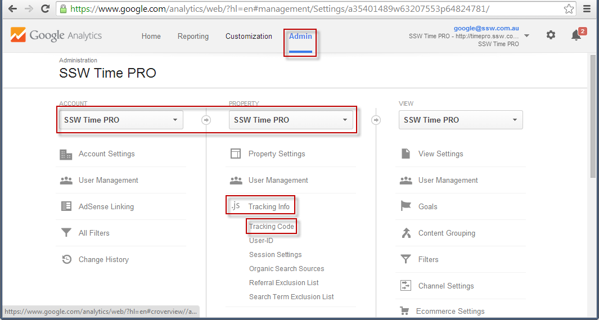
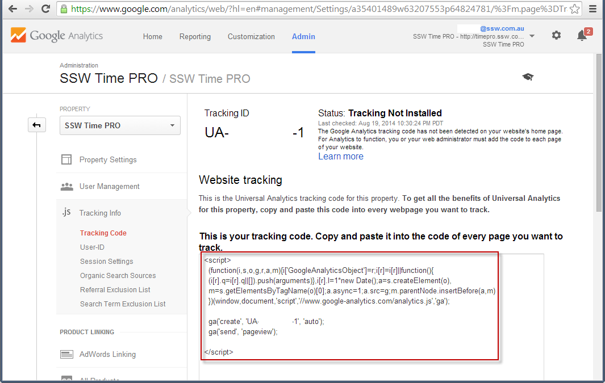
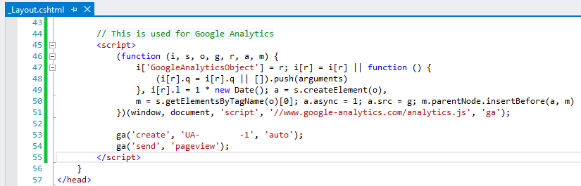

Google Analytics gives you a great insight into how, when and where your website is used. If you're not using an analytics package in your website, you're flying blind when it comes to understanding how, when and where your website is used.

<!--endintro-->

`youtube: https://youtu.be/I3GneD2bPJg`

By using Google Analytics, you will be able to see what your visitors are viewing and what they aren't, what they spend large amount's of time on, what pages are causing errors, what pages are directing visitors to you, which browsers and devices are being used to see your site and more. All this information help you better structure your site to what your visitors like. It also allows you to compare site traffic from one month to another.

The most useful reports:

* Which are the most popular pages of your website
* Which sites are referring the most hits to you
* Which keywords are bringing users to your site
* If you have downloads, which are the most popular

To add Google Analytics to your website:

1. [Log into your Google account](https://www.google.com/analytics), 
2. Go to **Admin** , 
3. Ensure both **Account**  and **Property**  
4. Specify your website details,
5. Find your **Tracking Code**, 
6. And add the script to your website

From this page, you will be able to get a JavaScript snippet to include in your application.

  

Once deployed, this script will start tracking metrics and interacting with Google Analytics. 

You are good to go!

## Adding Google Analytics to your blog

Using the above instructions, you can add Google Analytics to any website, including any blog. However, you may also find that your blogging platform or theme provides a way to set up Google Analytics using a plugin or other simple approach. Check your theme's documentation - sometimes it's as simple as adding the tracking code to configuration. Of course, adding the above JavaScript is easy enough in any case.
