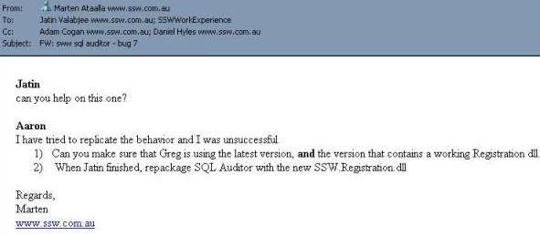

​​If you include more than one person in your email, include the name of the person/s you are addressing on the first line. Generally don't put more than one name in the "To" box, so that people won't have to be unsure to whom the email is addressed. If you have to address multiple people in an email (including yourself - i.e. notes to self), include each person's name as a heading as shown below. This helps them quickly locate the part of the email that applies to them.
 

 <excerpt class='endintro'></excerpt> 
<dl class="goodImage"><dt> </dt><dd>Figure: Good Example - When addressing multiple people, include each addressee's name as a separate heading</dd></dl>

   <b>Tip: </b>Use big headings by typing Control+Alt+3.

   <strong>Video: </strong><a href="https://www.youtube.com/watch?v=LAqRokqq4jI">Top 10+ Rules to Better Email Communication with Ulysses Maclaren</a>. 
<h3 class="ssw15-rteElement-H3">Related rule​ </h3>
<ul><li><a href="/_layouts/15/FIXUPREDIRECT.ASPX?WebId=3dfc0e07-e23a-4cbb-aac2-e778b71166a2&TermSetId=07da3ddf-0924-4cd2-a6d4-a4809ae20160&TermId=7c00a38b-6dbe-4445-9a3f-a4268b3dfada">Do you know who to put in the "To:" field?</a>​ </li></ul>

