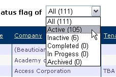

When designing your website, it's a good idea to help your users where possible.                     When you use a combo box, it's very helpful to be able to see at a glance how many                     results can be expected.

<!--endintro-->

::: bad  
  
:::

::: good  
  
:::
