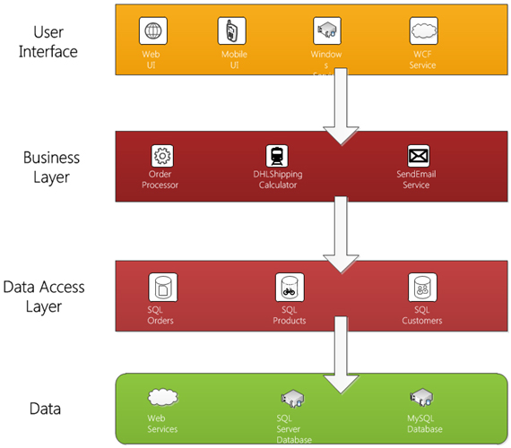
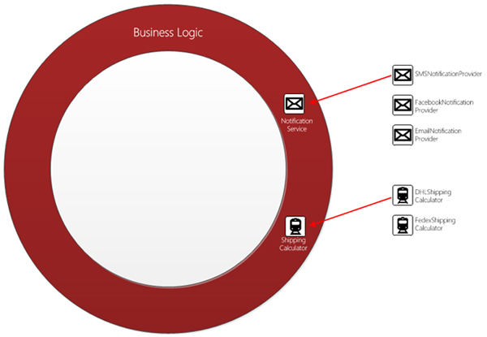
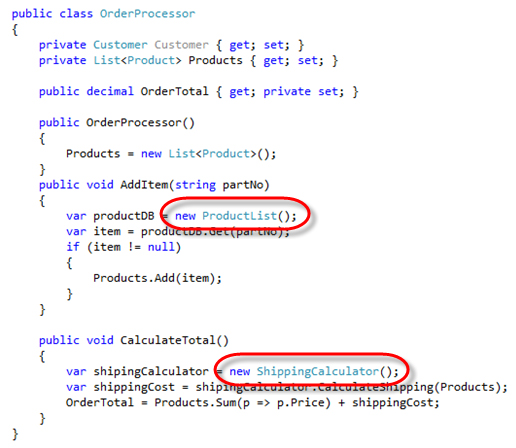
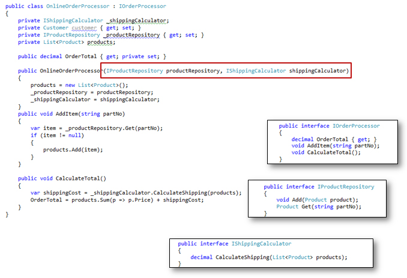

Injecting your dependency gives you:

<ul><li>Loosely coupled classes</li>
<li>Increased code reusing</li>
<li>Maintainable code</li>
<li>Testable methods</li>
<li>All dependencies are specified in one place </li>
<li>Class dependencies are clearly visible in the constructor</li></ul>
 <excerpt class='endintro'></excerpt> 
 Figure: Bad Example – A solution where each layer depends on static classes is not maintainable or testable  Figure: Good Example – Dependencies in each layer should only be interfaces. This allows dependencies to be easily interchanged and unit tests to be written against mock/fake objects  Figure: Bad Example – Classes should not include dependencies on database classes or business objects. Both of these classes may contain dependencies on external services like web services or databases  Figure: Good Example – The dependencies are injected into the class. This enables alternative classes to be injected. For example, a DHLShippingCalculator should be easily substituted for a FedexShippingCalculator. A MockShippingCalculator and MockProductRepository could be injected if we wanted to run unit tests 

