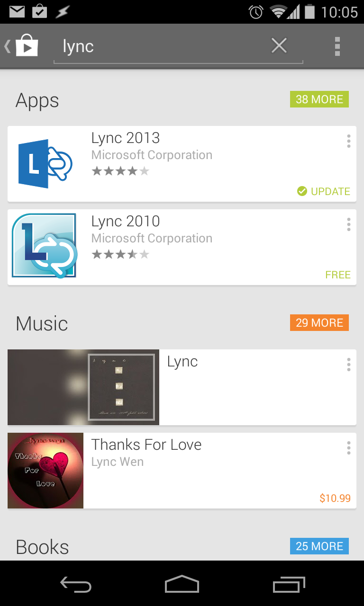
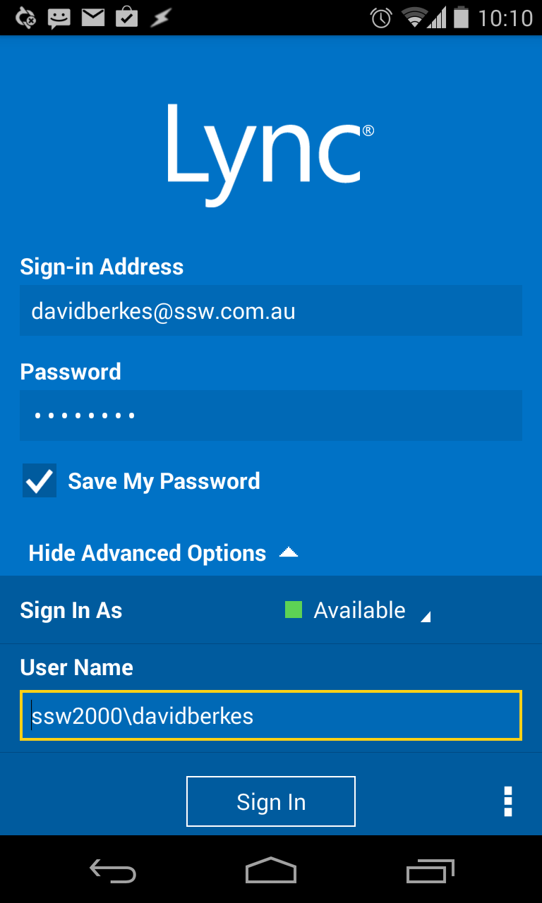

​​Installing MS Lync client on Andriod devices. Employees should be contactable no matter if they are in the office or not  (at a client). By installing the Lync client, everyone knows where they are and if they are available to take calls or answer questions that may arise.
 <excerpt class='endintro'></excerpt> 
<ol><li>Search for “Lync” in the <a href="https://play.google.com/store">Play store</a> 
<dl class="image"><dt></dt><dd>Figure: Search for Lync in Playstore</dd></dl></li><li>Install the Lync client on device</li><li>Set up Lync to sign into your account as follows:
<dl class="image"><dt></dt><dd>Figure: Lync sign in process</dd></dl>
You just need to enter 3 fields:
<ul><li>Sign in address is<strong> your email address</strong></li><li>Password is 
      <strong>your AD password</strong></li><li>Username is domain\username. For example SSW2000\davidberkes</li></ul></li></ol>

Read more about 
   <a href="http://www.ssw.com.au/ssw/Consulting/Lync.aspx">​implementing Microsoft Lync</a>.

