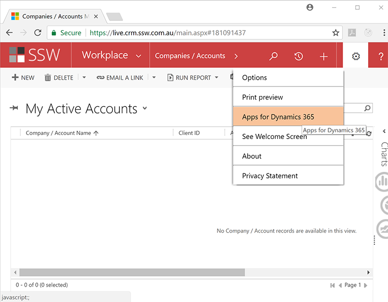

You should install the new Dynamics 365 App for Outlook to track your appointments, booking leave and developers for projects.

<!--endintro-->

### Pre-requisites:

> 1. On your PC, install Office 365: [http://portal.office.co](http://portal.office.com/)m
> 2. On your mobile phone, install the Outlook app
> 3. Set up your CRM mailbox: [https://rules.ssw.com.au/set-up-your-mailbox-in-crm](/_layouts/15/FIXUPREDIRECT.ASPX?WebId=3dfc0e07-e23a-4cbb-aac2-e778b71166a2&TermSetId=07da3ddf-0924-4cd2-a6d4-a4809ae20160&TermId=d702a7dc-2f7b-416d-a52d-f2d8dc956bd9)

### Install the Dynamics 365 App for Outlook

Follow these steps:

1. Open a new tab and navigate to your CRM. E.g. At SSW it is [https://ssw.crm6.com/](https://ssw.crm6.dynamics.com/main.aspx?app=d365default&forceUCI=1)
2. Slecect Settings (cog) | Advanced Settings
3. Select Settings (cog) | Apps For Dynamics 365
<dl class="image">&lt;dt&gt;  &lt;/dt&gt;<dd>Figure: Select Settings (cog) | Apps for Dynamics 365 menu item</dd></dl>
4. Install the App.
From this page, you should have the option to Download Dynamics 365 for Outlook and then follow the prompts to finish the configuration.
You can optionally install the new App (ask you SysAdmin for help if you're unable to get it working)
<dl class="image"><dl class="ssw15-rteElement-ImageArea">  </dl><dd>Figure: Dynamics 365 apps for Outlook.  </dd></dl>
5. You should now see the Dynamics 365 plugins available within Outlook (e.g. emails & appointments) 
<dl>&lt;dt&gt;<dl class="ssw15-rteElement-ImageArea"><dl class="ssw15-rteElement-ImageArea"> </dl></dl>   Figure: In Outlook open a new Email and see Dynamics 365 app that opens a Dynamics side-bar&lt;/dt&gt;</dl>

Now you can get up-and-running using CRM:

* [Scheduling - Do you know how to book developers for a project?](/_layouts/15/FIXUPREDIRECT.ASPX?WebId=3dfc0e07-e23a-4cbb-aac2-e778b71166a2&TermSetId=07da3ddf-0924-4cd2-a6d4-a4809ae20160&TermId=d51b4fd0-dc73-4e51-a6fd-e2354b6add89)
* [Sales - Do you track all sales related activities in CRM?](/_layouts/15/FIXUPREDIRECT.ASPX?WebId=3dfc0e07-e23a-4cbb-aac2-e778b71166a2&TermSetId=07da3ddf-0924-4cd2-a6d4-a4809ae20160&TermId=aad93e59-5977-466f-8ab5-39b21fbca4dd)
