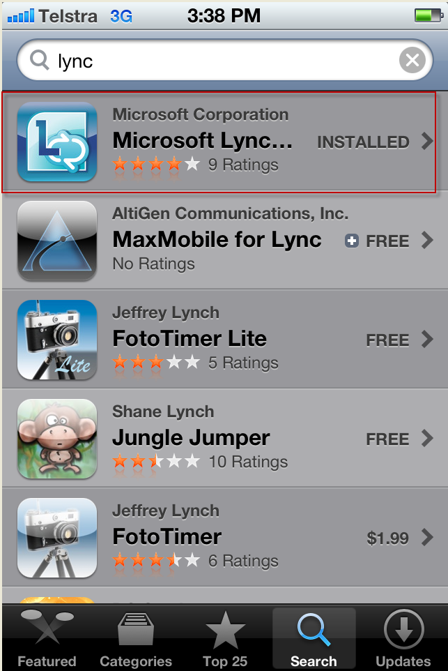
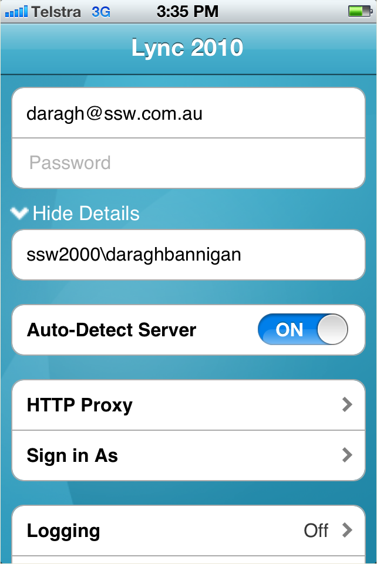

Installing MS Lync client on Iphone or Ipad. Employees should be contactable no matter if they are in the office or not  (at a client). By installing the Lync client, everyone knows where they are and if they are available to take calls or answer questions that may arise. 
<!--endintro-->

1. Search for “Lync” in the Apple App store        <dl class="image">&lt;dt&gt;
            
         &lt;/dt&gt;<dd>Figure: Search for Lync application in App store.</dd></dl>
2. Install the Lync client on device
3. Set up Lync to sign into your account as follows:        <dl class="image">&lt;dt&gt; 
            
         &lt;/dt&gt;<dd>Figure: you just need to enter 3 fields</dd></dl>
    * Sign-in address is your               **email address**
    * Password is your AD password
    * Username is domain\username. For example SSW2000\daraghbannigan

Read more about     [implementing Microsoft Lync](http://www.ssw.com.au/ssw/Consulting/Lync.aspx).
