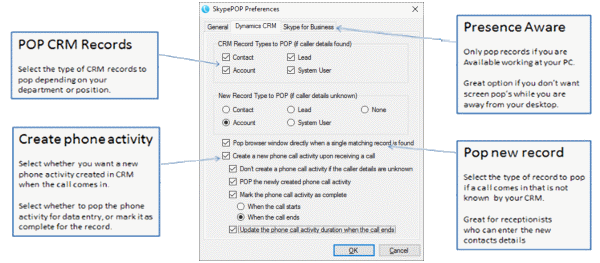

[SkypePOP](https://www.skypepop.com/product/skypepop) is an easy to use screen pop application that supports Office 365, Microsoft Skype for Business and Microsoft Dynamics CRM and CRM Online, maximizing your investment in these two leading applications.

Even though it works great for direct calls on Skype for Business, transferred calls will not show the CRM entry of the person being transferred. This is because SkypePOP will always recognize the person who transfers the call as the actual caller.

<!--endintro-->

### SkypePOP Features and Benefits

* With support Office 365, Microsoft Skype for Business 2015 (as well as older versions)
* Works with Skype for Business (doesn't work with Skype or Skype Preview)
* Fast - pop's CRM records in milliseconds
* Multiple records – handles multiple CRM records of different types with the same number
* Pops information from CRM Contacts, Leads, Accounts and System Users
* Presence Aware – control over what the application does based on Lync/OCS presence
* Phone Activity – provides multiple options to record the call against a CRM record

This tool is vital for sales staff and receptionists as a minimum.
Receptionists get the client record (based upon the inbound number) popup as the phone is ringing. They can answer the call accordantly. Sales staff has the ability to log the call in CRM along with what the call was about and also set a reminder for them to catch up in a few days.

Read more about [implementing Microsoft Lync](http://www.ssw.com.au/ssw/Consulting/Lync.aspx).

### SkypePOP Setup

::: good

:::
