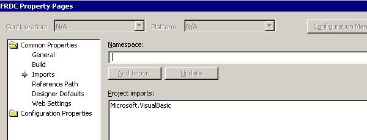

When programming in a Dot Net environment it is a good practice to remove the default imports that aren't used frequently in your code.   

This is because IntelliSense lists will be harder to use and navigate with too many imports. For example if in VB.NET, Microsoft.VisualBasic would be a good item to have in the imports list, because it will be used in most areas of your application.

<!--endintro-->

To remove all the default imports, load Project Property page and select Common properties - Imports.

 

The Import statement makes it easier to access methods of classes by eliminating the need to explicitly type the fully qualified reference names. Aliases let you assign a friendlier name to just one part of a namespace.

For example, the carriage return-line feed sequence that causes a single piece of text to be displayed on multiple lines is part of the ControlChars class in the Microsoft.VisualBasic namespace. To use this constant in a program without an alias, you would need to type the following code:

```vbnet
MsgBox("Some text" & Microsoft.VisualBasic.ControlChars.crlf _ & "Some more text")
```

Imports statements must always be the first lines immediately following any Option statements in a module. The following code fragment shows how to import and assign an alias to the Microsoft.VisualBasic.ControlChars namespace:

```vbnet
Imports CtrlChrs=Microsoft.VisualBasic.ControlChars
```

Future references to this namespace can be considerably shorter:

```vbnet
MsgBox("Some text" & CtrlChrs.crlf & "Some more text")
```

If an Imports statement does not include an alias name, elements defined within the imported namespace can be used in the module without qualification. If the alias name is specified, it must be used as a qualifier for names contained within that namespace.
