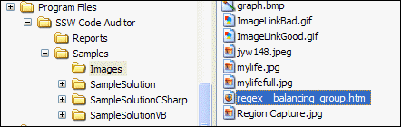
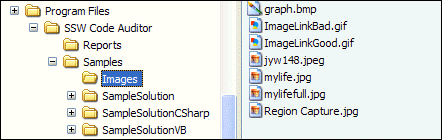

We want to keep clear and simple file structure in our solution. Never put any files other than images file in \images folder.  
<!--endintro-->

::: bad  
  
:::

::: good  
  
:::

| We have a program called [SSW Code Auditor](http://www.ssw.com.au/ssw/CodeAuditor/Default.aspx) to check for this rule. |
| --- |
