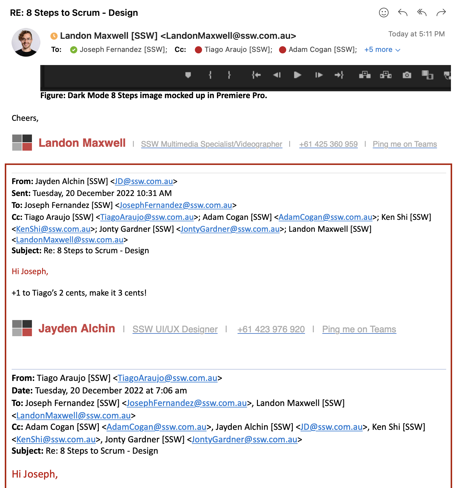

Often we receive a reply to an email and it has one word: "Done."

If the sender can't remember what was asked and the respondent has deleted the history, it's hard to tell what's going on. 

<!--endintro-->

It's not possible to check whether all questions were answered, or what URL was in the original email. Also, if someone else is Cc'ed, they won't have access to all information.

So, the only way is to go back into 'sent items', find what was asked for and copy and paste it into my reply, which can be very frustrating.

 So, **never delete the history when replying to an email**! Surely we aren't that hard up for disk space ;)

