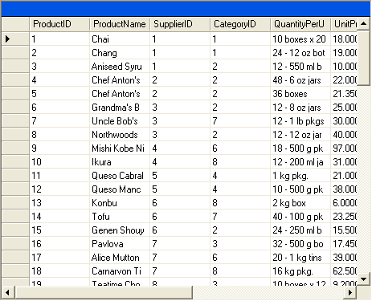
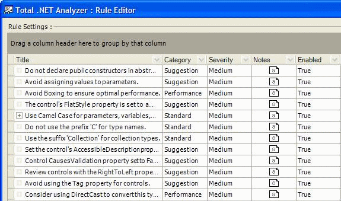
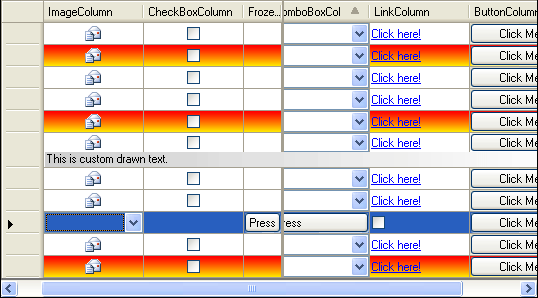

In Visual Studio 2003 the standard **DataGrid** has some limitations. It was ugly compared to a **ListView** and did not support combo box or button columns, making it useless for many applications.

In Visual Studio 2005 we have this great new **DataGridView** control which solves these problems.

<!--endintro-->

If you still want more then you need a 3rd party control. We recommend these (in this order):

1. Janus GridEx
2. Developer Express XtraGrid
3. Infragistics Wingrid
4. ComponentOne TrueDBGrid

For more Details have a look at our [Best 3rd Party Controls for Windows Forms](https://ssw.com.au/ssw/Standards/DeveloperGeneral/WinformControls.aspx)

::: bad

:::

::: good

:::

::: good

:::

